# [📈 Live Status](https://pemkotbekasi.github.io/website-status): <!--live status--> **🟧 Partial outage**

This repository contains the open-source uptime monitor and status page for [Pemerintah Kota Bekasi](https://www.bekasikota.go.id/), powered by [Upptime](https://github.com/upptime/upptime).

With [Upptime](https://upptime.js.org), you can get your own unlimited and free uptime monitor and status page, powered entirely by a GitHub repository. We use [Issues](https://github.com/pemkotbekasi/website-status/issues) as incident reports, [Actions](https://github.com/pemkotbekasi/website-status/actions) as uptime monitors, and [Pages](https://pemkotbekasi.github.io/website-status) for the status page.

<!--start: status pages-->
<!-- This summary is generated by Upptime (https://github.com/upptime/upptime) -->
<!-- Do not edit this manually, your changes will be overwritten -->
<!-- prettier-ignore -->
| URL | Status | History | Response Time | Uptime |
| --- | ------ | ------- | ------------- | ------ |
|  [Web Bekasikota](https://www.bekasikota.go.id/) | 🟩 Up | [web-bekasikota.yml](https://github.com/pemkotbekasi/website-status/commits/HEAD/history/web-bekasikota.yml) | 

 6530ms
     
 | 

<a href="https://pemkotbekasi.github.io/website-status/history/web-bekasikota">99.89%</a>
    

|  [Sekretariat Daerah](https://setda.bekasikota.go.id) | 🟥 Down | [sekretariat-daerah.yml](https://github.com/pemkotbekasi/website-status/commits/HEAD/history/sekretariat-daerah.yml) | 

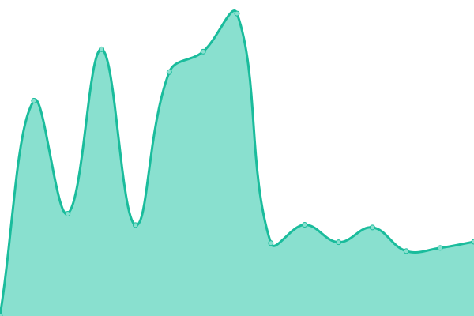 1742ms
     
 | 

<a href="https://pemkotbekasi.github.io/website-status/history/sekretariat-daerah">99.74%</a>
    

|  [Inspektorat](https://inspektorat.bekasikota.go.id) | 🟩 Up | [inspektorat.yml](https://github.com/pemkotbekasi/website-status/commits/HEAD/history/inspektorat.yml) | 

 1248ms
     
 | 

<a href="https://pemkotbekasi.github.io/website-status/history/inspektorat">100.00%</a>
    

|  [Sekretariat DPRD](https://dprd.bekasikota.go.id) | 🟩 Up | [sekretariat-dprd.yml](https://github.com/pemkotbekasi/website-status/commits/HEAD/history/sekretariat-dprd.yml) | 

 1864ms
     
 | 

<a href="https://pemkotbekasi.github.io/website-status/history/sekretariat-dprd">100.00%</a>
    

|  [Badan Kepegawaian, Pendidikan dan Pelatihan Daerah](https://bkppd.bekasikota.go.id) | 🟥 Down | [badan-kepegawaian-pendidikan-dan-pelatihan-daerah.yml](https://github.com/pemkotbekasi/website-status/commits/HEAD/history/badan-kepegawaian-pendidikan-dan-pelatihan-daerah.yml) | 

 0ms
     
 | 

<a href="https://pemkotbekasi.github.io/website-status/history/badan-kepegawaian-pendidikan-dan-pelatihan-daerah">100.00%</a>
    

|  [Badan Perencanaan Pembangunan Daerah](https://bappeda.bekasikota.go.id) | 🟥 Down | [badan-perencanaan-pembangunan-daerah.yml](https://github.com/pemkotbekasi/website-status/commits/HEAD/history/badan-perencanaan-pembangunan-daerah.yml) | 

 0ms
     
 | 

<a href="https://pemkotbekasi.github.io/website-status/history/badan-perencanaan-pembangunan-daerah">100.00%</a>
    

|  [Badan Pengelolaan Keuangan dan Aset Daerah](https://bpkad.bekasikota.go.id) | 🟩 Up | [badan-pengelolaan-keuangan-dan-aset-daerah.yml](https://github.com/pemkotbekasi/website-status/commits/HEAD/history/badan-pengelolaan-keuangan-dan-aset-daerah.yml) | 

 2289ms
     
 | 

<a href="https://pemkotbekasi.github.io/website-status/history/badan-pengelolaan-keuangan-dan-aset-daerah">100.00%</a>
    

|  [Badan Pendapatan Daerah](https://bapenda.bekasikota.go.id) | 🟥 Down | [badan-pendapatan-daerah.yml](https://github.com/pemkotbekasi/website-status/commits/HEAD/history/badan-pendapatan-daerah.yml) | 

 0ms
     
 | 

<a href="https://pemkotbekasi.github.io/website-status/history/badan-pendapatan-daerah">100.00%</a>
    

|  [Badan Kesatuan Bangsa dan Politik](https://kesbangpol.bekasikota.go.id) | 🟥 Down | [badan-kesatuan-bangsa-dan-politik.yml](https://github.com/pemkotbekasi/website-status/commits/HEAD/history/badan-kesatuan-bangsa-dan-politik.yml) | 

 1373ms
     
 | 

<a href="https://pemkotbekasi.github.io/website-status/history/badan-kesatuan-bangsa-dan-politik">99.96%</a>
    

|  [Badan Penanggulangan Bencana Daerah](https://bpbd.bekasikota.go.id) | 🟥 Down | [badan-penanggulangan-bencana-daerah.yml](https://github.com/pemkotbekasi/website-status/commits/HEAD/history/badan-penanggulangan-bencana-daerah.yml) | 

 1415ms
     
 | 

<a href="https://pemkotbekasi.github.io/website-status/history/badan-penanggulangan-bencana-daerah">99.96%</a>
    

|  [Badan Penelitian dan Pengembangan Daerah](https://balitbang.bekasikota.go.id) | 🟥 Down | [badan-penelitian-dan-pengembangan-daerah.yml](https://github.com/pemkotbekasi/website-status/commits/HEAD/history/badan-penelitian-dan-pengembangan-daerah.yml) | 

 0ms
     
 | 

<a href="https://pemkotbekasi.github.io/website-status/history/badan-penelitian-dan-pengembangan-daerah">100.00%</a>
    

|  [Dinas Penanaman Modal dan Pelayanan Terpadu Satu Pintu](https://dpmptsp.bekasikota.go.id) | 🟩 Up | [dinas-penanaman-modal-dan-pelayanan-terpadu-satu-pintu.yml](https://github.com/pemkotbekasi/website-status/commits/HEAD/history/dinas-penanaman-modal-dan-pelayanan-terpadu-satu-pintu.yml) | 

 1886ms
     
 | 

<a href="https://pemkotbekasi.github.io/website-status/history/dinas-penanaman-modal-dan-pelayanan-terpadu-satu-pintu">100.00%</a>
    

|  [Dinas Lingkungan Hidup](https://dlh.bekasikota.go.id) | 🟩 Up | [dinas-lingkungan-hidup.yml](https://github.com/pemkotbekasi/website-status/commits/HEAD/history/dinas-lingkungan-hidup.yml) | 

 1595ms
     
 | 

<a href="https://pemkotbekasi.github.io/website-status/history/dinas-lingkungan-hidup">100.00%</a>
    

|  [Dinas Pendidikan](https://disdik.bekasikota.go.id) | 🟩 Up | [dinas-pendidikan.yml](https://github.com/pemkotbekasi/website-status/commits/HEAD/history/dinas-pendidikan.yml) | 

 3743ms
     
 | 

<a href="https://pemkotbekasi.github.io/website-status/history/dinas-pendidikan">100.00%</a>
    

|  [Dinas Kesehatan](https://dinkes.bekasikota.go.id) | 🟥 Down | [dinas-kesehatan.yml](https://github.com/pemkotbekasi/website-status/commits/HEAD/history/dinas-kesehatan.yml) | 

 1834ms
     
 | 

<a href="https://pemkotbekasi.github.io/website-status/history/dinas-kesehatan">99.98%</a>
    

|  [Dinas Pemadam Kebakaran](https://damkar.bekasikota.go.id) | 🟩 Up | [dinas-pemadam-kebakaran.yml](https://github.com/pemkotbekasi/website-status/commits/HEAD/history/dinas-pemadam-kebakaran.yml) | 

 2969ms
     
 | 

<a href="https://pemkotbekasi.github.io/website-status/history/dinas-pemadam-kebakaran">100.00%</a>
    

|  [Dinas Kependudukan dan Pencatatan Sipil](https://disdukcapil.bekasikota.go.id) | 🟥 Down | [dinas-kependudukan-dan-pencatatan-sipil.yml](https://github.com/pemkotbekasi/website-status/commits/HEAD/history/dinas-kependudukan-dan-pencatatan-sipil.yml) | 

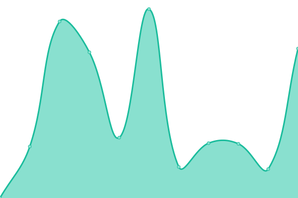 1953ms
     
 | 

<a href="https://pemkotbekasi.github.io/website-status/history/dinas-kependudukan-dan-pencatatan-sipil">99.98%</a>
    

|  [Dinas Komunikasi Informatika Statistik dan Persandian](https://diskominfo.bekasikota.go.id) | 🟩 Up | [dinas-komunikasi-informatika-statistik-dan-persandian.yml](https://github.com/pemkotbekasi/website-status/commits/HEAD/history/dinas-komunikasi-informatika-statistik-dan-persandian.yml) | 

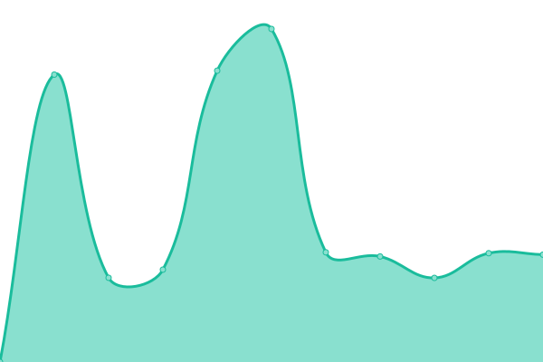 2249ms
     
 | 

<a href="https://pemkotbekasi.github.io/website-status/history/dinas-komunikasi-informatika-statistik-dan-persandian">100.00%</a>
    

|  [Dinas Pemuda dan Olahraga](https://dispora.bekasikota.go.id) | 🟥 Down | [dinas-pemuda-dan-olahraga.yml](https://github.com/pemkotbekasi/website-status/commits/HEAD/history/dinas-pemuda-dan-olahraga.yml) | 

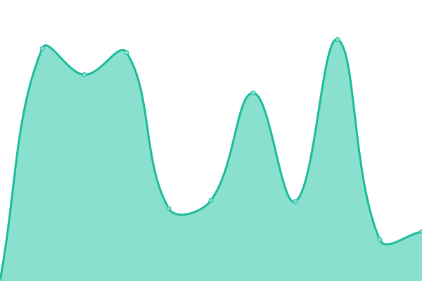 2377ms
     
 | 

<a href="https://pemkotbekasi.github.io/website-status/history/dinas-pemuda-dan-olahraga">99.98%</a>
    

|  [Dinas Tata Ruang](https://distaru.bekasikota.go.id) | 🟥 Down | [dinas-tata-ruang.yml](https://github.com/pemkotbekasi/website-status/commits/HEAD/history/dinas-tata-ruang.yml) | 

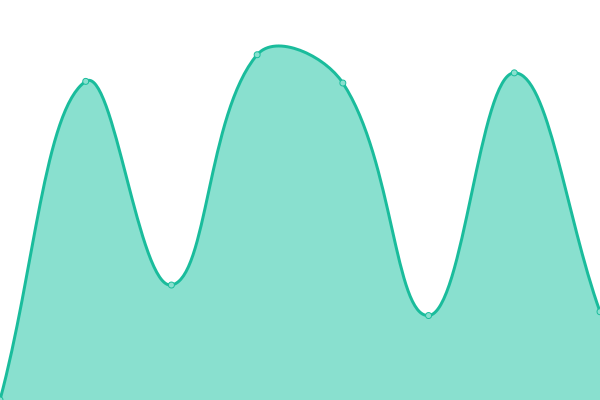 1571ms
     
 | 

<a href="https://pemkotbekasi.github.io/website-status/history/dinas-tata-ruang">99.98%</a>
    

|  [Dinas Bina Marga dan Sumber daya Air](https://dbmsda.bekasikota.go.id) | 🟥 Down | [dinas-bina-marga-dan-sumber-daya-air.yml](https://github.com/pemkotbekasi/website-status/commits/HEAD/history/dinas-bina-marga-dan-sumber-daya-air.yml) | 

 1664ms
     
 | 

<a href="https://pemkotbekasi.github.io/website-status/history/dinas-bina-marga-dan-sumber-daya-air">99.77%</a>
    

|  [Dinas Perumahan, Kawasan Permukiman dan Pertanahan](https://disperkimtan.bekasikota.go.id) | 🟥 Down | [dinas-perumahan-kawasan-permukiman-dan-pertanahan.yml](https://github.com/pemkotbekasi/website-status/commits/HEAD/history/dinas-perumahan-kawasan-permukiman-dan-pertanahan.yml) | 

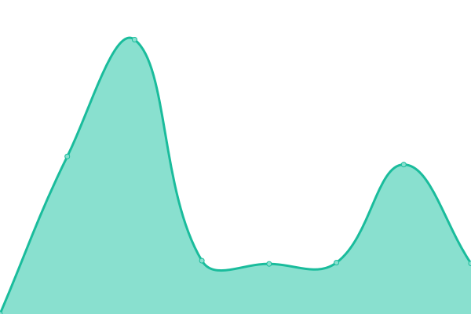 1926ms
     
 | 

<a href="https://pemkotbekasi.github.io/website-status/history/dinas-perumahan-kawasan-permukiman-dan-pertanahan">99.78%</a>
    

|  [Dinas Kearsipan](https://disarsip.bekasikota.go.id) | 🟥 Down | [dinas-kearsipan.yml](https://github.com/pemkotbekasi/website-status/commits/HEAD/history/dinas-kearsipan.yml) | 

 0ms
     
 | 

<a href="https://pemkotbekasi.github.io/website-status/history/dinas-kearsipan">100.00%</a>
    

|  [Dinas Pemberdayaan Perempuan dan Perlindungan Anak](https://dpppa.bekasikota.go.id) | 🟥 Down | [dinas-pemberdayaan-perempuan-dan-perlindungan-anak.yml](https://github.com/pemkotbekasi/website-status/commits/HEAD/history/dinas-pemberdayaan-perempuan-dan-perlindungan-anak.yml) | 

 1902ms
     
 | 

<a href="https://pemkotbekasi.github.io/website-status/history/dinas-pemberdayaan-perempuan-dan-perlindungan-anak">99.78%</a>
    

|  [Dinas Perpustakaan Daerah](https://disperpus.bekasikota.go.id) | 🟥 Down | [dinas-perpustakaan-daerah.yml](https://github.com/pemkotbekasi/website-status/commits/HEAD/history/dinas-perpustakaan-daerah.yml) | 

 0ms
     
 | 

<a href="https://pemkotbekasi.github.io/website-status/history/dinas-perpustakaan-daerah">100.00%</a>
    

|  [Dinas Pengendalian Penduduk dan Keluarga Berencana](https://dppkb.bekasikota.go.id) | 🟩 Up | [dinas-pengendalian-penduduk-dan-keluarga-berencana.yml](https://github.com/pemkotbekasi/website-status/commits/HEAD/history/dinas-pengendalian-penduduk-dan-keluarga-berencana.yml) | 

 2550ms
     
 | 

<a href="https://pemkotbekasi.github.io/website-status/history/dinas-pengendalian-penduduk-dan-keluarga-berencana">100.00%</a>
    

|  [Dinas Pariwisata dan Kebudayaan](https://disparbud.bekasikota.go.id) | 🟥 Down | [dinas-pariwisata-dan-kebudayaan.yml](https://github.com/pemkotbekasi/website-status/commits/HEAD/history/dinas-pariwisata-dan-kebudayaan.yml) | 

 2541ms
     
 | 

<a href="https://pemkotbekasi.github.io/website-status/history/dinas-pariwisata-dan-kebudayaan">99.79%</a>
    

|  [Dinas Sosial](https://dinsos.bekasikota.go.id) | 🟥 Down | [dinas-sosial.yml](https://github.com/pemkotbekasi/website-status/commits/HEAD/history/dinas-sosial.yml) | 

 0ms
     
 | 

<a href="https://pemkotbekasi.github.io/website-status/history/dinas-sosial">100.00%</a>
    

|  [Dinas Tenaga Kerja](https://disnaker.bekasikota.go.id) | 🟩 Up | [dinas-tenaga-kerja.yml](https://github.com/pemkotbekasi/website-status/commits/HEAD/history/dinas-tenaga-kerja.yml) | 

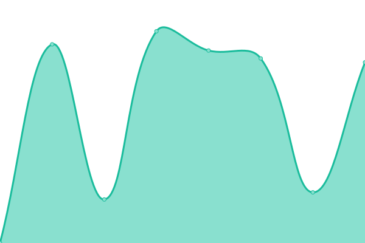 2337ms
     
 | 

<a href="https://pemkotbekasi.github.io/website-status/history/dinas-tenaga-kerja">100.00%</a>
    

|  [Dinas Perhubungan](https://dishub.bekasikota.go.id) | 🟥 Down | [dinas-perhubungan.yml](https://github.com/pemkotbekasi/website-status/commits/HEAD/history/dinas-perhubungan.yml) | 

 2026ms
     
 | 

<a href="https://pemkotbekasi.github.io/website-status/history/dinas-perhubungan">99.63%</a>
    

|  [Dinas Koperasi, Usaha Kecil dan Menengah](https://dkukm.bekasikota.go.id) | 🟩 Up | [dinas-koperasi-usaha-kecil-dan-menengah.yml](https://github.com/pemkotbekasi/website-status/commits/HEAD/history/dinas-koperasi-usaha-kecil-dan-menengah.yml) | 

 1769ms
     
 | 

<a href="https://pemkotbekasi.github.io/website-status/history/dinas-koperasi-usaha-kecil-dan-menengah">99.65%</a>
    

|  [Dinas Pertanian dan Perikanan](https://distanikan.bekasikota.go.id) | 🟥 Down | [dinas-pertanian-dan-perikanan.yml](https://github.com/pemkotbekasi/website-status/commits/HEAD/history/dinas-pertanian-dan-perikanan.yml) | 

 0ms
     
 | 

<a href="https://pemkotbekasi.github.io/website-status/history/dinas-pertanian-dan-perikanan">100.00%</a>
    

|  [Dinas Perdagangan dan Perindustrian](https://disdagperin.bekasikota.go.id) | 🟩 Up | [dinas-perdagangan-dan-perindustrian.yml](https://github.com/pemkotbekasi/website-status/commits/HEAD/history/dinas-perdagangan-dan-perindustrian.yml) | 

 2364ms
     
 | 

<a href="https://pemkotbekasi.github.io/website-status/history/dinas-perdagangan-dan-perindustrian">99.65%</a>
    

|  [Dinas Ketahanan Pangan](https://disketapang.bekasikota.go.id) | 🟥 Down | [dinas-ketahanan-pangan.yml](https://github.com/pemkotbekasi/website-status/commits/HEAD/history/dinas-ketahanan-pangan.yml) | 

 0ms
     
 | 

<a href="https://pemkotbekasi.github.io/website-status/history/dinas-ketahanan-pangan">100.00%</a>
    

|  [Satpol PP](https://satpolpp.bekasikota.go.id) | 🟩 Up | [satpol-pp.yml](https://github.com/pemkotbekasi/website-status/commits/HEAD/history/satpol-pp.yml) | 

 2175ms
     
 | 

<a href="https://pemkotbekasi.github.io/website-status/history/satpol-pp">99.82%</a>
    

|  [RSUD](https://rsud.bekasikota.go.id) | 🟩 Up | [rsud.yml](https://github.com/pemkotbekasi/website-status/commits/HEAD/history/rsud.yml) | 

 4134ms
     
 | 

<a href="https://pemkotbekasi.github.io/website-status/history/rsud">99.72%</a>
    

|  [Kecamatan Bekasi Timur](https://kec-bekasitimur.bekasikota.go.id) | 🟩 Up | [kecamatan-bekasi-timur.yml](https://github.com/pemkotbekasi/website-status/commits/HEAD/history/kecamatan-bekasi-timur.yml) | 

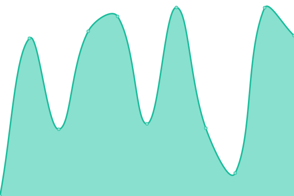 2403ms
     
 | 

<a href="https://pemkotbekasi.github.io/website-status/history/kecamatan-bekasi-timur">0.00%</a>
    

|  [Kecamatan Rawa Lumbu](https://kec-rawalumbu.bekasikota.go.id) | 🟩 Up | [kecamatan-rawa-lumbu.yml](https://github.com/pemkotbekasi/website-status/commits/HEAD/history/kecamatan-rawa-lumbu.yml) | 

 2365ms
     
 | 

<a href="https://pemkotbekasi.github.io/website-status/history/kecamatan-rawa-lumbu">0.00%</a>
    

|  [Kecamatan Pondok Gede](https://kec-pondokgede.bekasikota.go.id) | 🟩 Up | [kecamatan-pondok-gede.yml](https://github.com/pemkotbekasi/website-status/commits/HEAD/history/kecamatan-pondok-gede.yml) | 

 2369ms
     
 | 

<a href="https://pemkotbekasi.github.io/website-status/history/kecamatan-pondok-gede">99.84%</a>
    

|  [Kecamatan Mustika Jaya](https://kec-mustikajaya.bekasikota.go.id) | 🟩 Up | [kecamatan-mustika-jaya.yml](https://github.com/pemkotbekasi/website-status/commits/HEAD/history/kecamatan-mustika-jaya.yml) | 

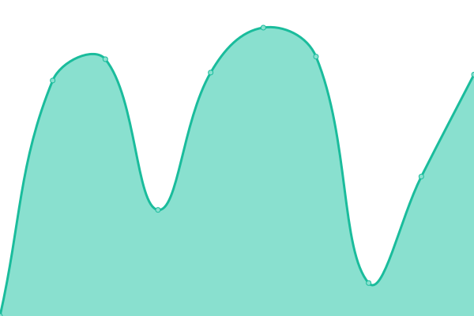 2402ms
     
 | 

<a href="https://pemkotbekasi.github.io/website-status/history/kecamatan-mustika-jaya">100.00%</a>
    

|  [Kecamatan Medan Satria](https://kec-medansatria.bekasikota.go.id) | 🟩 Up | [kecamatan-medan-satria.yml](https://github.com/pemkotbekasi/website-status/commits/HEAD/history/kecamatan-medan-satria.yml) | 

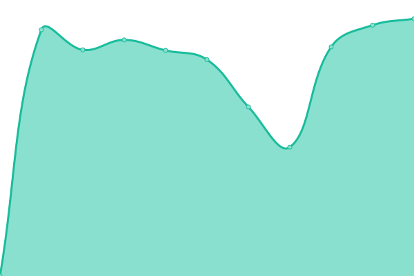 2354ms
     
 | 

<a href="https://pemkotbekasi.github.io/website-status/history/kecamatan-medan-satria">100.00%</a>
    

|  [Kecamatan Jati Sampurna](https://kec-jatisampurna.bekasikota.go.id) | 🟩 Up | [kecamatan-jati-sampurna.yml](https://github.com/pemkotbekasi/website-status/commits/HEAD/history/kecamatan-jati-sampurna.yml) | 

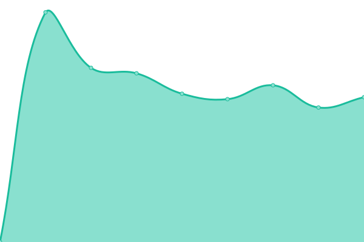 2612ms
     
 | 

<a href="https://pemkotbekasi.github.io/website-status/history/kecamatan-jati-sampurna">100.00%</a>
    

|  [Kecamatan Jati Asih](https://kec-jatiasih.bekasikota.go.id) | 🟩 Up | [kecamatan-jati-asih.yml](https://github.com/pemkotbekasi/website-status/commits/HEAD/history/kecamatan-jati-asih.yml) | 

 2445ms
     
 | 

<a href="https://pemkotbekasi.github.io/website-status/history/kecamatan-jati-asih">100.00%</a>
    

|  [Kecamatan Bekasi Utara](https://kec-bekasiutara.bekasikota.go.id) | 🟩 Up | [kecamatan-bekasi-utara.yml](https://github.com/pemkotbekasi/website-status/commits/HEAD/history/kecamatan-bekasi-utara.yml) | 

 2458ms
     
 | 

<a href="https://pemkotbekasi.github.io/website-status/history/kecamatan-bekasi-utara">100.00%</a>
    

|  [Kecamatan Bekasi Selatan](https://kec-bekasiselatan.bekasikota.go.id) | 🟩 Up | [kecamatan-bekasi-selatan.yml](https://github.com/pemkotbekasi/website-status/commits/HEAD/history/kecamatan-bekasi-selatan.yml) | 

 2443ms
     
 | 

<a href="https://pemkotbekasi.github.io/website-status/history/kecamatan-bekasi-selatan">100.00%</a>
    

|  [Kecamatan Bekasi Barat](https://kec-bekasibarat.bekasikota.go.id) | 🟩 Up | [kecamatan-bekasi-barat.yml](https://github.com/pemkotbekasi/website-status/commits/HEAD/history/kecamatan-bekasi-barat.yml) | 

 2426ms
     
 | 

<a href="https://pemkotbekasi.github.io/website-status/history/kecamatan-bekasi-barat">100.00%</a>
    

|  [Kecamatan Bantar Gebang](https://kec-bantargebang.bekasikota.go.id) | 🟩 Up | [kecamatan-bantar-gebang.yml](https://github.com/pemkotbekasi/website-status/commits/HEAD/history/kecamatan-bantar-gebang.yml) | 

 2381ms
     
 | 

<a href="https://pemkotbekasi.github.io/website-status/history/kecamatan-bantar-gebang">100.00%</a>
    

|  [Kecamatan Pondok Melati](https://kec-pondokmelati.bekasikota.go.id) | 🟩 Up | [kecamatan-pondok-melati.yml](https://github.com/pemkotbekasi/website-status/commits/HEAD/history/kecamatan-pondok-melati.yml) | 

 2412ms
     
 | 

<a href="https://pemkotbekasi.github.io/website-status/history/kecamatan-pondok-melati">100.00%</a>
    

<!--end: status pages-->

[**Visit our status website →**](https://pemkotbekasi.github.io/website-status)

## 📄 License

- Powered by: [Upptime](https://github.com/upptime/upptime)
- Code: [MIT](./LICENSE) © [Pemerintah Kota Bekasi](https://www.bekasikota.go.id/)
- Data in the `./history` directory: [Open Database License](https://opendatacommons.org/licenses/odbl/1-0/)
