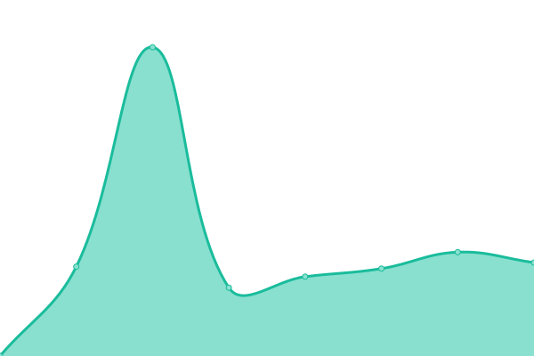

# [📈 Live Status](https://pemkotbekasi.github.io/website-status): <!--live status--> **🟥 Complete outage**

This repository contains the open-source uptime monitor and status page for [Pemerintah Kota Bekasi](https://www.bekasikota.go.id/), powered by [Upptime](https://github.com/upptime/upptime).

With [Upptime](https://upptime.js.org), you can get your own unlimited and free uptime monitor and status page, powered entirely by a GitHub repository. We use [Issues](https://github.com/pemkotbekasi/website-status/issues) as incident reports, [Actions](https://github.com/pemkotbekasi/website-status/actions) as uptime monitors, and [Pages](https://pemkotbekasi.github.io/website-status) for the status page.

<!--start: status pages-->
<!-- This summary is generated by Upptime (https://github.com/upptime/upptime) -->
<!-- Do not edit this manually, your changes will be overwritten -->
<!-- prettier-ignore -->
| URL | Status | History | Response Time | Uptime |
| --- | ------ | ------- | ------------- | ------ |
|  [BSRe](https://api-bsre.bssn.go.id/v2) | 🟥 Down | [bs-re.yml](https://github.com/pemkotbekasi/website-status/commits/HEAD/history/bs-re.yml) | 

 1644ms
     
 | 

<a href="https://pemkotbekasi.github.io/website-status/history/bs-re">99.34%</a>
    

<!--end: status pages-->

[**Visit our status website →**](https://pemkotbekasi.github.io/website-status)

## 📄 License

- Powered by: [Upptime](https://github.com/upptime/upptime)
- Code: [MIT](./LICENSE) © [Pemerintah Kota Bekasi](https://www.bekasikota.go.id/)
- Data in the `./history` directory: [Open Database License](https://opendatacommons.org/licenses/odbl/1-0/)
