# [📈 Live Status](https://pemkotbekasi.github.io/website-status): <!--live status--> **🟧 Partial outage**

This repository contains the open-source uptime monitor and status page for [Pemerintah Kota Bekasi](https://www.bekasikota.go.id/), powered by [Upptime](https://github.com/upptime/upptime).

With [Upptime](https://upptime.js.org), you can get your own unlimited and free uptime monitor and status page, powered entirely by a GitHub repository. We use [Issues](https://github.com/pemkotbekasi/website-status/issues) as incident reports, [Actions](https://github.com/pemkotbekasi/website-status/actions) as uptime monitors, and [Pages](https://pemkotbekasi.github.io/website-status) for the status page.

<!--start: status pages-->
<!-- This summary is generated by Upptime (https://github.com/upptime/upptime) -->
<!-- Do not edit this manually, your changes will be overwritten -->
<!-- prettier-ignore -->
| URL | Status | History | Response Time | Uptime |
| --- | ------ | ------- | ------------- | ------ |
|  [BSRe API](https://api-bsre.bssn.go.id/v2) | 🟩 Up | [bs-re-api.yml](https://github.com/pemkotbekasi/website-status/commits/HEAD/history/bs-re-api.yml) | 

 2187ms
     
 | 

<a href="https://pemkotbekasi.github.io/website-status/history/bs-re-api">100.00%</a>
    

|  [absensi](https://absensi.bekasikota.go.id) | 🟩 Up | [absensi.yml](https://github.com/pemkotbekasi/website-status/commits/HEAD/history/absensi.yml) | 

 1475ms
     
 | 

<a href="https://pemkotbekasi.github.io/website-status/history/absensi">100.00%</a>
    

|  [amdal](https://amdal.bekasikota.go.id) | 🟥 Down | [amdal.yml](https://github.com/pemkotbekasi/website-status/commits/HEAD/history/amdal.yml) | 

 1480ms
     
 | 

<a href="https://pemkotbekasi.github.io/website-status/history/amdal">94.88%</a>
    

|  [asb](https://asb.bekasikota.go.id) | 🟩 Up | [asb.yml](https://github.com/pemkotbekasi/website-status/commits/HEAD/history/asb.yml) | 

 1346ms
     
 | 

<a href="https://pemkotbekasi.github.io/website-status/history/asb">31.89%</a>
    

|  [ayokerja](https://ayokerja.bekasikota.go.id) | 🟩 Up | [ayokerja.yml](https://github.com/pemkotbekasi/website-status/commits/HEAD/history/ayokerja.yml) | 

 1803ms
     
 | 

<a href="https://pemkotbekasi.github.io/website-status/history/ayokerja">83.43%</a>
    

|  [bapenda](https://bapenda.bekasikota.go.id) | 🟥 Down | [bapenda.yml](https://github.com/pemkotbekasi/website-status/commits/HEAD/history/bapenda.yml) | 

 0ms
     
 | 

<a href="https://pemkotbekasi.github.io/website-status/history/bapenda">100.00%</a>
    

|  [bappelitbangda](https://bappelitbangda.bekasikota.go.id) | 🟩 Up | [bappelitbangda.yml](https://github.com/pemkotbekasi/website-status/commits/HEAD/history/bappelitbangda.yml) | 

 12653ms
     
 | 

<a href="https://pemkotbekasi.github.io/website-status/history/bappelitbangda">99.18%</a>
    

|  [best](https://best.bekasikota.go.id) | 🟩 Up | [best.yml](https://github.com/pemkotbekasi/website-status/commits/HEAD/history/best.yml) | 

 1658ms
     
 | 

<a href="https://pemkotbekasi.github.io/website-status/history/best">31.90%</a>
    

|  [bkpsdm](https://bkpsdm.bekasikota.go.id) | 🟩 Up | [bkpsdm.yml](https://github.com/pemkotbekasi/website-status/commits/HEAD/history/bkpsdm.yml) | 

 1772ms
     
 | 

<a href="https://pemkotbekasi.github.io/website-status/history/bkpsdm">0.00%</a>
    

|  [blud](https://blud.bekasikota.go.id) | 🟩 Up | [blud.yml](https://github.com/pemkotbekasi/website-status/commits/HEAD/history/blud.yml) | 

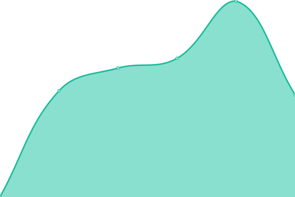 1186ms
     
 | 

<a href="https://pemkotbekasi.github.io/website-status/history/blud">31.90%</a>
    

|  [bludpald](https://bludpald.bekasikota.go.id) | 🟩 Up | [bludpald.yml](https://github.com/pemkotbekasi/website-status/commits/HEAD/history/bludpald.yml) | 

 4227ms
     
 | 

<a href="https://pemkotbekasi.github.io/website-status/history/bludpald">100.00%</a>
    

|  [bmd](https://bmd.bekasikota.go.id) | 🟩 Up | [bmd.yml](https://github.com/pemkotbekasi/website-status/commits/HEAD/history/bmd.yml) | 

 1807ms
     
 | 

<a href="https://pemkotbekasi.github.io/website-status/history/bmd">60.90%</a>
    

|  [bos](https://bos.bekasikota.go.id) | 🟩 Up | [bos.yml](https://github.com/pemkotbekasi/website-status/commits/HEAD/history/bos.yml) | 

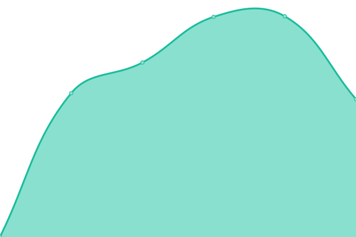 1166ms
     
 | 

<a href="https://pemkotbekasi.github.io/website-status/history/bos">31.90%</a>
    

|  [bpbd](https://bpbd.bekasikota.go.id) | 🟩 Up | [bpbd.yml](https://github.com/pemkotbekasi/website-status/commits/HEAD/history/bpbd.yml) | 

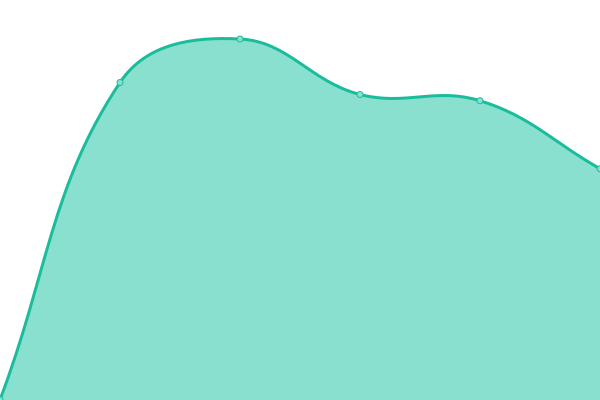 1488ms
     
 | 

<a href="https://pemkotbekasi.github.io/website-status/history/bpbd">0.00%</a>
    

|  [bpkad](https://bpkad.bekasikota.go.id) | 🟩 Up | [bpkad.yml](https://github.com/pemkotbekasi/website-status/commits/HEAD/history/bpkad.yml) | 

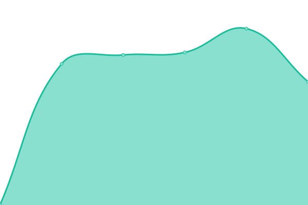 2355ms
     
 | 

<a href="https://pemkotbekasi.github.io/website-status/history/bpkad">61.10%</a>
    

|  [bpsk](https://bpsk.bekasikota.go.id) | 🟥 Down | [bpsk.yml](https://github.com/pemkotbekasi/website-status/commits/HEAD/history/bpsk.yml) | 

 0ms
     
 | 

<a href="https://pemkotbekasi.github.io/website-status/history/bpsk">100.00%</a>
    

|  [bpum2022](https://bpum2022.bekasikota.go.id) | 🟥 Down | [bpum2022.yml](https://github.com/pemkotbekasi/website-status/commits/HEAD/history/bpum2022.yml) | 

 1115ms
     
 | 

<a href="https://pemkotbekasi.github.io/website-status/history/bpum2022">100.00%</a>
    

|  [brankas](https://brankas.bekasikota.go.id) | 🟥 Down | [brankas.yml](https://github.com/pemkotbekasi/website-status/commits/HEAD/history/brankas.yml) | 

 0ms
     
 | 

<a href="https://pemkotbekasi.github.io/website-status/history/brankas">100.00%</a>
    

|  [cbm](https://cbm.bekasikota.go.id) | 🟩 Up | [cbm.yml](https://github.com/pemkotbekasi/website-status/commits/HEAD/history/cbm.yml) | 

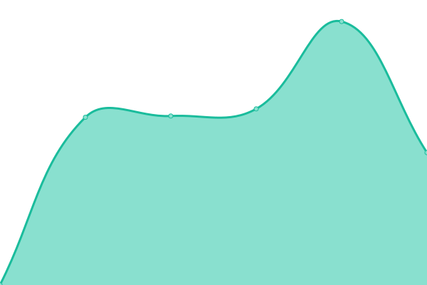 1133ms
     
 | 

<a href="https://pemkotbekasi.github.io/website-status/history/cbm">32.09%</a>
    

|  [damkar](https://damkar.bekasikota.go.id) | 🟩 Up | [damkar.yml](https://github.com/pemkotbekasi/website-status/commits/HEAD/history/damkar.yml) | 

 3987ms
     
 | 

<a href="https://pemkotbekasi.github.io/website-status/history/damkar">48.13%</a>
    

|  [danta](https://danta.bekasikota.go.id) | 🟥 Down | [danta.yml](https://github.com/pemkotbekasi/website-status/commits/HEAD/history/danta.yml) | 

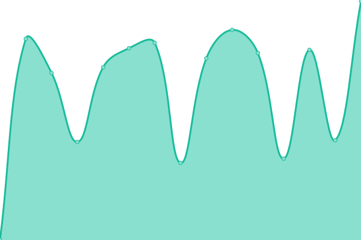 0ms
     
 | 

<a href="https://pemkotbekasi.github.io/website-status/history/danta">0.00%</a>
    

|  [danta-admin](https://danta-admin.bekasikota.go.id) | 🟥 Down | [danta-admin.yml](https://github.com/pemkotbekasi/website-status/commits/HEAD/history/danta-admin.yml) | 

 0ms
     
 | 

<a href="https://pemkotbekasi.github.io/website-status/history/danta-admin">0.00%</a>
    

|  [dapodik](https://dapodik.bekasikota.go.id) | 🟩 Up | [dapodik.yml](https://github.com/pemkotbekasi/website-status/commits/HEAD/history/dapodik.yml) | 

 1556ms
     
 | 

<a href="https://pemkotbekasi.github.io/website-status/history/dapodik">99.79%</a>
    

|  [dashboardcc](https://dashboardcc.bekasikota.go.id) | 🟩 Up | [dashboardcc.yml](https://github.com/pemkotbekasi/website-status/commits/HEAD/history/dashboardcc.yml) | 

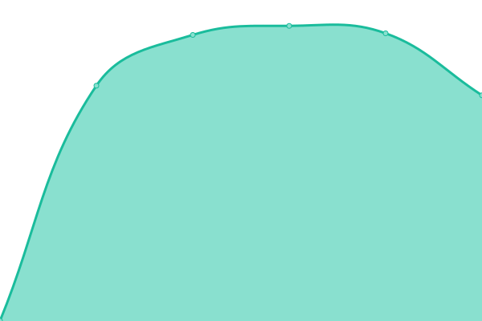 1352ms
     
 | 

<a href="https://pemkotbekasi.github.io/website-status/history/dashboardcc">100.00%</a>
    

|  [databpkad](https://databpkad.bekasikota.go.id) | 🟩 Up | [databpkad.yml](https://github.com/pemkotbekasi/website-status/commits/HEAD/history/databpkad.yml) | 

 1126ms
     
 | 

<a href="https://pemkotbekasi.github.io/website-status/history/databpkad">32.09%</a>
    

|  [dbdisnaker](https://dbdisnaker.bekasikota.go.id) | 🟥 Down | [dbdisnaker.yml](https://github.com/pemkotbekasi/website-status/commits/HEAD/history/dbdisnaker.yml) | 

 0ms
     
 | 

<a href="https://pemkotbekasi.github.io/website-status/history/dbdisnaker">100.00%</a>
    

|  [dbmsda](https://dbmsda.bekasikota.go.id) | 🟥 Down | [dbmsda.yml](https://github.com/pemkotbekasi/website-status/commits/HEAD/history/dbmsda.yml) | 

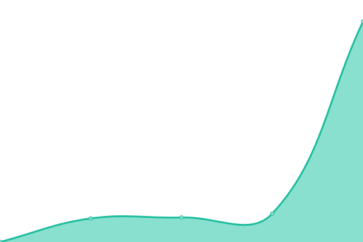 1646ms
     
 | 

<a href="https://pemkotbekasi.github.io/website-status/history/dbmsda">99.35%</a>
    

|  [digitaru](https://digitaru.bekasikota.go.id) | 🟩 Up | [digitaru.yml](https://github.com/pemkotbekasi/website-status/commits/HEAD/history/digitaru.yml) | 

 1576ms
     
 | 

<a href="https://pemkotbekasi.github.io/website-status/history/digitaru">100.00%</a>
    

|  [dinkes](https://dinkes.bekasikota.go.id) | 🟩 Up | [dinkes.yml](https://github.com/pemkotbekasi/website-status/commits/HEAD/history/dinkes.yml) | 

 1862ms
     
 | 

<a href="https://pemkotbekasi.github.io/website-status/history/dinkes">42.88%</a>
    

|  [dinsos](https://dinsos.bekasikota.go.id) | 🟥 Down | [dinsos.yml](https://github.com/pemkotbekasi/website-status/commits/HEAD/history/dinsos.yml) | 

 0ms
     
 | 

<a href="https://pemkotbekasi.github.io/website-status/history/dinsos">100.00%</a>
    

|  [disarpusda](https://disarpusda.bekasikota.go.id) | 🟩 Up | [disarpusda.yml](https://github.com/pemkotbekasi/website-status/commits/HEAD/history/disarpusda.yml) | 

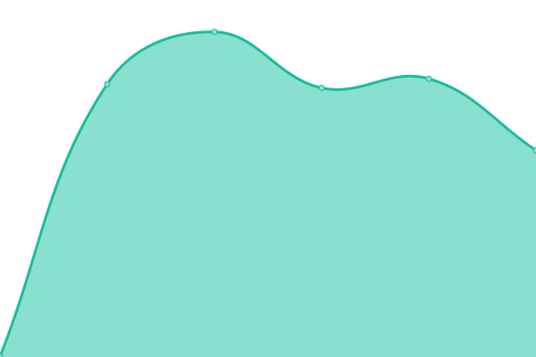 1534ms
     
 | 

<a href="https://pemkotbekasi.github.io/website-status/history/disarpusda">0.00%</a>
    

|  [disdagperin](https://disdagperin.bekasikota.go.id) | 🟥 Down | [disdagperin.yml](https://github.com/pemkotbekasi/website-status/commits/HEAD/history/disdagperin.yml) | 

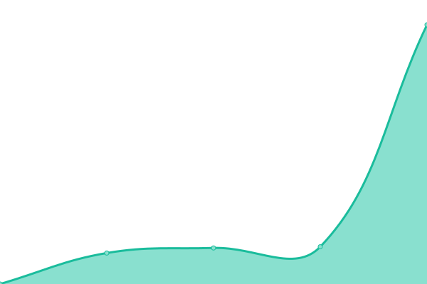 2214ms
     
 | 

<a href="https://pemkotbekasi.github.io/website-status/history/disdagperin">99.38%</a>
    

|  [disdik](https://disdik.bekasikota.go.id) | 🟩 Up | [disdik.yml](https://github.com/pemkotbekasi/website-status/commits/HEAD/history/disdik.yml) | 

 4578ms
     
 | 

<a href="https://pemkotbekasi.github.io/website-status/history/disdik">85.35%</a>
    

|  [disdukcapil](https://disdukcapil.bekasikota.go.id) | 🟥 Down | [disdukcapil.yml](https://github.com/pemkotbekasi/website-status/commits/HEAD/history/disdukcapil.yml) | 

 2221ms
     
 | 

<a href="https://pemkotbekasi.github.io/website-status/history/disdukcapil">27.13%</a>
    

|  [dishub](https://dishub.bekasikota.go.id) | 🟩 Up | [dishub.yml](https://github.com/pemkotbekasi/website-status/commits/HEAD/history/dishub.yml) | 

 1617ms
     
 | 

<a href="https://pemkotbekasi.github.io/website-status/history/dishub">0.00%</a>
    

|  [diskominfo](https://diskominfo.bekasikota.go.id) | 🟩 Up | [diskominfo.yml](https://github.com/pemkotbekasi/website-status/commits/HEAD/history/diskominfo.yml) | 

 2241ms
     
 | 

<a href="https://pemkotbekasi.github.io/website-status/history/diskominfo">39.25%</a>
    

|  [disnaker](https://disnaker.bekasikota.go.id) | 🟩 Up | [disnaker.yml](https://github.com/pemkotbekasi/website-status/commits/HEAD/history/disnaker.yml) | 

 1375ms
     
 | 

<a href="https://pemkotbekasi.github.io/website-status/history/disnaker">0.00%</a>
    

|  [disparbud](https://disparbud.bekasikota.go.id) | 🟥 Down | [disparbud.yml](https://github.com/pemkotbekasi/website-status/commits/HEAD/history/disparbud.yml) | 

 2012ms
     
 | 

<a href="https://pemkotbekasi.github.io/website-status/history/disparbud">45.75%</a>
    

|  [disperkimtan](https://disperkimtan.bekasikota.go.id) | 🟥 Down | [disperkimtan.yml](https://github.com/pemkotbekasi/website-status/commits/HEAD/history/disperkimtan.yml) | 

 1919ms
     
 | 

<a href="https://pemkotbekasi.github.io/website-status/history/disperkimtan">99.46%</a>
    

|  [dispora](https://dispora.bekasikota.go.id) | 🟥 Down | [dispora.yml](https://github.com/pemkotbekasi/website-status/commits/HEAD/history/dispora.yml) | 

 3388ms
     
 | 

<a href="https://pemkotbekasi.github.io/website-status/history/dispora">45.49%</a>
    

|  [distaru](https://distaru.bekasikota.go.id) | 🟥 Down | [distaru.yml](https://github.com/pemkotbekasi/website-status/commits/HEAD/history/distaru.yml) | 

 1759ms
     
 | 

<a href="https://pemkotbekasi.github.io/website-status/history/distaru">0.00%</a>
    

|  [dkppp](https://dkppp.bekasikota.go.id) | 🟥 Down | [dkppp.yml](https://github.com/pemkotbekasi/website-status/commits/HEAD/history/dkppp.yml) | 

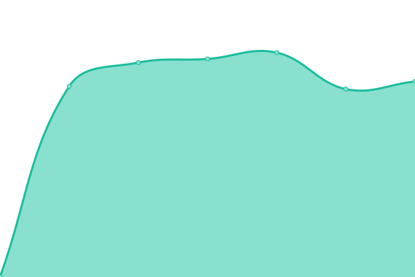 3407ms
     
 | 

<a href="https://pemkotbekasi.github.io/website-status/history/dkppp">47.90%</a>
    

|  [dkukm](https://dkukm.bekasikota.go.id) | 🟥 Down | [dkukm.yml](https://github.com/pemkotbekasi/website-status/commits/HEAD/history/dkukm.yml) | 

 1629ms
     
 | 

<a href="https://pemkotbekasi.github.io/website-status/history/dkukm">82.78%</a>
    

|  [dlh](https://dlh.bekasikota.go.id) | 🟥 Down | [dlh.yml](https://github.com/pemkotbekasi/website-status/commits/HEAD/history/dlh.yml) | 

 1632ms
     
 | 

<a href="https://pemkotbekasi.github.io/website-status/history/dlh">99.84%</a>
    

|  [dpmptsp](https://dpmptsp.bekasikota.go.id) | 🟩 Up | [dpmptsp.yml](https://github.com/pemkotbekasi/website-status/commits/HEAD/history/dpmptsp.yml) | 

 2082ms
     
 | 

<a href="https://pemkotbekasi.github.io/website-status/history/dpmptsp">100.00%</a>
    

|  [dppkb](https://dppkb.bekasikota.go.id) | 🟥 Down | [dppkb.yml](https://github.com/pemkotbekasi/website-status/commits/HEAD/history/dppkb.yml) | 

 3718ms
     
 | 

<a href="https://pemkotbekasi.github.io/website-status/history/dppkb">45.99%</a>
    

|  [dpppa](https://dpppa.bekasikota.go.id) | 🟥 Down | [dpppa.yml](https://github.com/pemkotbekasi/website-status/commits/HEAD/history/dpppa.yml) | 

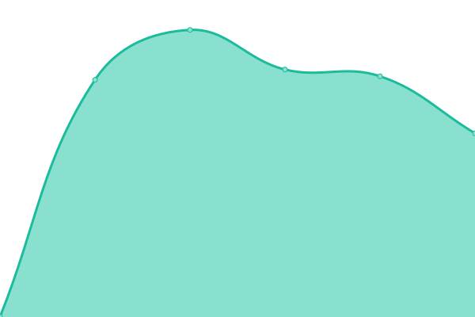 1401ms
     
 | 

<a href="https://pemkotbekasi.github.io/website-status/history/dpppa">0.00%</a>
    

|  [dprd](https://dprd.bekasikota.go.id) | 🟥 Down | [dprd.yml](https://github.com/pemkotbekasi/website-status/commits/HEAD/history/dprd.yml) | 

 1798ms
     
 | 

<a href="https://pemkotbekasi.github.io/website-status/history/dprd">95.07%</a>
    

|  [ebphtb](https://ebphtb.bekasikota.go.id) | 🟥 Down | [ebphtb.yml](https://github.com/pemkotbekasi/website-status/commits/HEAD/history/ebphtb.yml) | 

 0ms
     
 | 

<a href="https://pemkotbekasi.github.io/website-status/history/ebphtb">100.00%</a>
    

|  [eofficev2](https://eofficev2.bekasikota.go.id) | 🟩 Up | [eofficev2.yml](https://github.com/pemkotbekasi/website-status/commits/HEAD/history/eofficev2.yml) | 

 1163ms
     
 | 

<a href="https://pemkotbekasi.github.io/website-status/history/eofficev2">99.19%</a>
    

|  [e-pbb](https://e-pbb.bekasikota.go.id) | 🟥 Down | [e-pbb.yml](https://github.com/pemkotbekasi/website-status/commits/HEAD/history/e-pbb.yml) | 

 0ms
     
 | 

<a href="https://pemkotbekasi.github.io/website-status/history/e-pbb">100.00%</a>
    

|  [esht](https://esht.bekasikota.go.id) | 🟥 Down | [esht.yml](https://github.com/pemkotbekasi/website-status/commits/HEAD/history/esht.yml) | 

 0ms
     
 | 

<a href="https://pemkotbekasi.github.io/website-status/history/esht">100.00%</a>
    

|  [e-sinjab](https://e-sinjab.bekasikota.go.id) | 🟩 Up | [e-sinjab.yml](https://github.com/pemkotbekasi/website-status/commits/HEAD/history/e-sinjab.yml) | 

 1386ms
     
 | 

<a href="https://pemkotbekasi.github.io/website-status/history/e-sinjab">99.67%</a>
    

|  [e-sosial](https://e-sosial.bekasikota.go.id) | 🟩 Up | [e-sosial.yml](https://github.com/pemkotbekasi/website-status/commits/HEAD/history/e-sosial.yml) | 

 1372ms
     
 | 

<a href="https://pemkotbekasi.github.io/website-status/history/e-sosial">5.46%</a>
    

|  [esppt](https://esppt.bekasikota.go.id) | 🟥 Down | [esppt.yml](https://github.com/pemkotbekasi/website-status/commits/HEAD/history/esppt.yml) | 

 0ms
     
 | 

<a href="https://pemkotbekasi.github.io/website-status/history/esppt">100.00%</a>
    

|  [e-tawa](https://e-tawa.bekasikota.go.id) | 🟩 Up | [e-tawa.yml](https://github.com/pemkotbekasi/website-status/commits/HEAD/history/e-tawa.yml) | 

 1603ms
     
 | 

<a href="https://pemkotbekasi.github.io/website-status/history/e-tawa">4.80%</a>
    

|  [ews](https://ews.bekasikota.go.id) | 🟥 Down | [ews.yml](https://github.com/pemkotbekasi/website-status/commits/HEAD/history/ews.yml) | 

 0ms
     
 | 

<a href="https://pemkotbekasi.github.io/website-status/history/ews">100.00%</a>
    

|  [eyeclick](https://eyeclick.bekasikota.go.id) | 🟩 Up | [eyeclick.yml](https://github.com/pemkotbekasi/website-status/commits/HEAD/history/eyeclick.yml) | 

 1713ms
     
 | 

<a href="https://pemkotbekasi.github.io/website-status/history/eyeclick">31.87%</a>
    

|  [face](https://face.bekasikota.go.id) | 🟩 Up | [face.yml](https://github.com/pemkotbekasi/website-status/commits/HEAD/history/face.yml) | 

 1624ms
     
 | 

<a href="https://pemkotbekasi.github.io/website-status/history/face">31.87%</a>
    

|  [firemap](https://firemap.bekasikota.go.id) | 🟩 Up | [firemap.yml](https://github.com/pemkotbekasi/website-status/commits/HEAD/history/firemap.yml) | 

 1873ms
     
 | 

<a href="https://pemkotbekasi.github.io/website-status/history/firemap">99.38%</a>
    

|  [gis](https://gis.bekasikota.go.id) | 🟥 Down | [gis.yml](https://github.com/pemkotbekasi/website-status/commits/HEAD/history/gis.yml) | 

 0ms
     
 | 

<a href="https://pemkotbekasi.github.io/website-status/history/gis">100.00%</a>
    

|  [idamantri](https://idamantri.bekasikota.go.id) | 🟥 Down | [idamantri.yml](https://github.com/pemkotbekasi/website-status/commits/HEAD/history/idamantri.yml) | 

 0ms
     
 | 

<a href="https://pemkotbekasi.github.io/website-status/history/idamantri">100.00%</a>
    

|  [inspektorat](https://inspektorat.bekasikota.go.id) | 🟩 Up | [inspektorat.yml](https://github.com/pemkotbekasi/website-status/commits/HEAD/history/inspektorat.yml) | 

 1579ms
     
 | 

<a href="https://pemkotbekasi.github.io/website-status/history/inspektorat">91.34%</a>
    

|  [iwmis](https://iwmis.bekasikota.go.id) | 🟥 Down | [iwmis.yml](https://github.com/pemkotbekasi/website-status/commits/HEAD/history/iwmis.yml) | 

 0ms
     
 | 

<a href="https://pemkotbekasi.github.io/website-status/history/iwmis">100.00%</a>
    

|  [jdih](https://jdih.bekasikota.go.id) | 🟩 Up | [jdih.yml](https://github.com/pemkotbekasi/website-status/commits/HEAD/history/jdih.yml) | 

 1579ms
     
 | 

<a href="https://pemkotbekasi.github.io/website-status/history/jdih">0.00%</a>
    

|  [jdih-dprd](https://jdih-dprd.bekasikota.go.id) | 🟩 Up | [jdih-dprd.yml](https://github.com/pemkotbekasi/website-status/commits/HEAD/history/jdih-dprd.yml) | 

 1638ms
     
 | 

<a href="https://pemkotbekasi.github.io/website-status/history/jdih-dprd">0.00%</a>
    

|  [kasda](https://kasda.bekasikota.go.id) | 🟩 Up | [kasda.yml](https://github.com/pemkotbekasi/website-status/commits/HEAD/history/kasda.yml) | 

 2163ms
     
 | 

<a href="https://pemkotbekasi.github.io/website-status/history/kasda">88.24%</a>
    

|  [k-cloud](https://k-cloud.bekasikota.go.id) | 🟥 Down | [k-cloud.yml](https://github.com/pemkotbekasi/website-status/commits/HEAD/history/k-cloud.yml) | 

 0ms
     
 | 

<a href="https://pemkotbekasi.github.io/website-status/history/k-cloud">0.00%</a>
    

|  [kecamatan](https://kecamatan.bekasikota.go.id) | 🟩 Up | [kecamatan.yml](https://github.com/pemkotbekasi/website-status/commits/HEAD/history/kecamatan.yml) | 

 4423ms
     
 | 

<a href="https://pemkotbekasi.github.io/website-status/history/kecamatan">81.31%</a>
    

|  [kec-bantargebang](https://kec-bantargebang.bekasikota.go.id) | 🟩 Up | [kec-bantargebang.yml](https://github.com/pemkotbekasi/website-status/commits/HEAD/history/kec-bantargebang.yml) | 

 3540ms
     
 | 

<a href="https://pemkotbekasi.github.io/website-status/history/kec-bantargebang">50.10%</a>
    

|  [kec-bekasibarat](https://kec-bekasibarat.bekasikota.go.id) | 🟩 Up | [kec-bekasibarat.yml](https://github.com/pemkotbekasi/website-status/commits/HEAD/history/kec-bekasibarat.yml) | 

 3930ms
     
 | 

<a href="https://pemkotbekasi.github.io/website-status/history/kec-bekasibarat">59.93%</a>
    

|  [kec-bekasiselatan](https://kec-bekasiselatan.bekasikota.go.id) | 🟩 Up | [kec-bekasiselatan.yml](https://github.com/pemkotbekasi/website-status/commits/HEAD/history/kec-bekasiselatan.yml) | 

 3414ms
     
 | 

<a href="https://pemkotbekasi.github.io/website-status/history/kec-bekasiselatan">96.06%</a>
    

|  [kec-bekasitimur](https://kec-bekasitimur.bekasikota.go.id) | 🟩 Up | [kec-bekasitimur.yml](https://github.com/pemkotbekasi/website-status/commits/HEAD/history/kec-bekasitimur.yml) | 

 3549ms
     
 | 

<a href="https://pemkotbekasi.github.io/website-status/history/kec-bekasitimur">93.91%</a>
    

|  [kec-bekasiutara](https://kec-bekasiutara.bekasikota.go.id) | 🟩 Up | [kec-bekasiutara.yml](https://github.com/pemkotbekasi/website-status/commits/HEAD/history/kec-bekasiutara.yml) | 

 3416ms
     
 | 

<a href="https://pemkotbekasi.github.io/website-status/history/kec-bekasiutara">94.46%</a>
    

|  [kec-jatiasih](https://kec-jatiasih.bekasikota.go.id) | 🟩 Up | [kec-jatiasih.yml](https://github.com/pemkotbekasi/website-status/commits/HEAD/history/kec-jatiasih.yml) | 

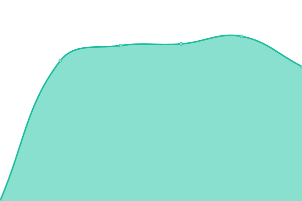 3534ms
     
 | 

<a href="https://pemkotbekasi.github.io/website-status/history/kec-jatiasih">94.74%</a>
    

|  [kec-jatisampurna](https://kec-jatisampurna.bekasikota.go.id) | 🟩 Up | [kec-jatisampurna.yml](https://github.com/pemkotbekasi/website-status/commits/HEAD/history/kec-jatisampurna.yml) | 

 3355ms
     
 | 

<a href="https://pemkotbekasi.github.io/website-status/history/kec-jatisampurna">98.92%</a>
    

|  [kec-medansatria](https://kec-medansatria.bekasikota.go.id) | 🟩 Up | [kec-medansatria.yml](https://github.com/pemkotbekasi/website-status/commits/HEAD/history/kec-medansatria.yml) | 

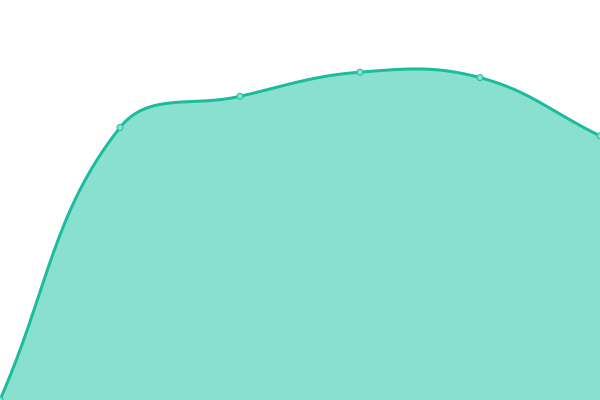 3436ms
     
 | 

<a href="https://pemkotbekasi.github.io/website-status/history/kec-medansatria">99.22%</a>
    

|  [kec-mustikajaya](https://kec-mustikajaya.bekasikota.go.id) | 🟩 Up | [kec-mustikajaya.yml](https://github.com/pemkotbekasi/website-status/commits/HEAD/history/kec-mustikajaya.yml) | 

 3611ms
     
 | 

<a href="https://pemkotbekasi.github.io/website-status/history/kec-mustikajaya">99.51%</a>
    

|  [kec-pondokgede](https://kec-pondokgede.bekasikota.go.id) | 🟩 Up | [kec-pondokgede.yml](https://github.com/pemkotbekasi/website-status/commits/HEAD/history/kec-pondokgede.yml) | 

 3734ms
     
 | 

<a href="https://pemkotbekasi.github.io/website-status/history/kec-pondokgede">99.53%</a>
    

|  [kec-pondokmelati](https://kec-pondokmelati.bekasikota.go.id) | 🟩 Up | [kec-pondokmelati.yml](https://github.com/pemkotbekasi/website-status/commits/HEAD/history/kec-pondokmelati.yml) | 

 3463ms
     
 | 

<a href="https://pemkotbekasi.github.io/website-status/history/kec-pondokmelati">95.98%</a>
    

|  [kec-rawalumbu](https://kec-rawalumbu.bekasikota.go.id) | 🟩 Up | [kec-rawalumbu.yml](https://github.com/pemkotbekasi/website-status/commits/HEAD/history/kec-rawalumbu.yml) | 

 3477ms
     
 | 

<a href="https://pemkotbekasi.github.io/website-status/history/kec-rawalumbu">99.21%</a>
    

|  [kel-arenjaya](https://kel-arenjaya.bekasikota.go.id) | 🟩 Up | [kel-arenjaya.yml](https://github.com/pemkotbekasi/website-status/commits/HEAD/history/kel-arenjaya.yml) | 

 1250ms
     
 | 

<a href="https://pemkotbekasi.github.io/website-status/history/kel-arenjaya">100.00%</a>
    

|  [kel-bantargebang](https://kel-bantargebang.bekasikota.go.id) | 🟩 Up | [kel-bantargebang.yml](https://github.com/pemkotbekasi/website-status/commits/HEAD/history/kel-bantargebang.yml) | 

 1984ms
     
 | 

<a href="https://pemkotbekasi.github.io/website-status/history/kel-bantargebang">100.00%</a>
    

|  [kel-bekasijaya](https://kel-bekasijaya.bekasikota.go.id) | 🟩 Up | [kel-bekasijaya.yml](https://github.com/pemkotbekasi/website-status/commits/HEAD/history/kel-bekasijaya.yml) | 

 1206ms
     
 | 

<a href="https://pemkotbekasi.github.io/website-status/history/kel-bekasijaya">100.00%</a>
    

|  [kel-bintara](https://kel-bintara.bekasikota.go.id) | 🟩 Up | [kel-bintara.yml](https://github.com/pemkotbekasi/website-status/commits/HEAD/history/kel-bintara.yml) | 

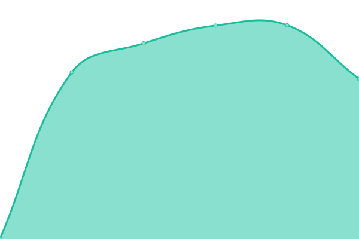 1134ms
     
 | 

<a href="https://pemkotbekasi.github.io/website-status/history/kel-bintara">100.00%</a>
    

|  [kel-bintarajaya](https://kel-bintarajaya.bekasikota.go.id) | 🟩 Up | [kel-bintarajaya.yml](https://github.com/pemkotbekasi/website-status/commits/HEAD/history/kel-bintarajaya.yml) | 

 1245ms
     
 | 

<a href="https://pemkotbekasi.github.io/website-status/history/kel-bintarajaya">100.00%</a>
    

|  [kel-bojongmenteng](https://kel-bojongmenteng.bekasikota.go.id) | 🟩 Up | [kel-bojongmenteng.yml](https://github.com/pemkotbekasi/website-status/commits/HEAD/history/kel-bojongmenteng.yml) | 

 1130ms
     
 | 

<a href="https://pemkotbekasi.github.io/website-status/history/kel-bojongmenteng">100.00%</a>
    

|  [kel-bojongrawalumbu](https://kel-bojongrawalumbu.bekasikota.go.id) | 🟩 Up | [kel-bojongrawalumbu.yml](https://github.com/pemkotbekasi/website-status/commits/HEAD/history/kel-bojongrawalumbu.yml) | 

 1138ms
     
 | 

<a href="https://pemkotbekasi.github.io/website-status/history/kel-bojongrawalumbu">100.00%</a>
    

|  [kel-ciketingudik](https://kel-ciketingudik.bekasikota.go.id) | 🟩 Up | [kel-ciketingudik.yml](https://github.com/pemkotbekasi/website-status/commits/HEAD/history/kel-ciketingudik.yml) | 

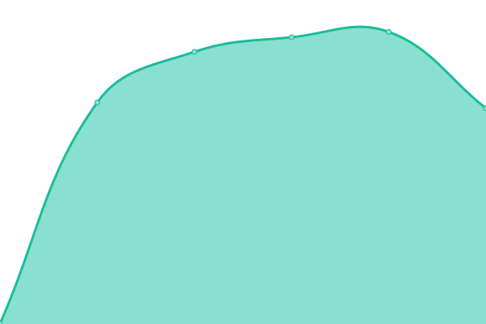 1203ms
     
 | 

<a href="https://pemkotbekasi.github.io/website-status/history/kel-ciketingudik">100.00%</a>
    

|  [kel-cikiwul](https://kel-cikiwul.bekasikota.go.id) | 🟩 Up | [kel-cikiwul.yml](https://github.com/pemkotbekasi/website-status/commits/HEAD/history/kel-cikiwul.yml) | 

 1146ms
     
 | 

<a href="https://pemkotbekasi.github.io/website-status/history/kel-cikiwul">100.00%</a>
    

|  [kel-cimuning](https://kel-cimuning.bekasikota.go.id) | 🟩 Up | [kel-cimuning.yml](https://github.com/pemkotbekasi/website-status/commits/HEAD/history/kel-cimuning.yml) | 

 1123ms
     
 | 

<a href="https://pemkotbekasi.github.io/website-status/history/kel-cimuning">100.00%</a>
    

|  [kel-durenjaya](https://kel-durenjaya.bekasikota.go.id) | 🟩 Up | [kel-durenjaya.yml](https://github.com/pemkotbekasi/website-status/commits/HEAD/history/kel-durenjaya.yml) | 

 1142ms
     
 | 

<a href="https://pemkotbekasi.github.io/website-status/history/kel-durenjaya">100.00%</a>
    

|  [kel-harapanbaru](https://kel-harapanbaru.bekasikota.go.id) | 🟩 Up | [kel-harapanbaru.yml](https://github.com/pemkotbekasi/website-status/commits/HEAD/history/kel-harapanbaru.yml) | 

 1140ms
     
 | 

<a href="https://pemkotbekasi.github.io/website-status/history/kel-harapanbaru">100.00%</a>
    

|  [kel-harapanjaya](https://kel-harapanjaya.bekasikota.go.id) | 🟩 Up | [kel-harapanjaya.yml](https://github.com/pemkotbekasi/website-status/commits/HEAD/history/kel-harapanjaya.yml) | 

 1121ms
     
 | 

<a href="https://pemkotbekasi.github.io/website-status/history/kel-harapanjaya">100.00%</a>
    

|  [kel-harapanmulya](https://kel-harapanmulya.bekasikota.go.id) | 🟩 Up | [kel-harapanmulya.yml](https://github.com/pemkotbekasi/website-status/commits/HEAD/history/kel-harapanmulya.yml) | 

 1131ms
     
 | 

<a href="https://pemkotbekasi.github.io/website-status/history/kel-harapanmulya">100.00%</a>
    

|  [kel-jakamulya](https://kel-jakamulya.bekasikota.go.id) | 🟩 Up | [kel-jakamulya.yml](https://github.com/pemkotbekasi/website-status/commits/HEAD/history/kel-jakamulya.yml) | 

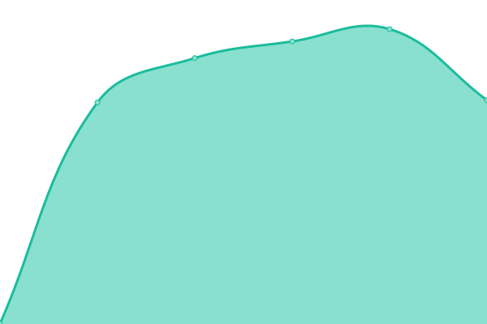 1130ms
     
 | 

<a href="https://pemkotbekasi.github.io/website-status/history/kel-jakamulya">100.00%</a>
    

|  [kel-jakasampurna](https://kel-jakasampurna.bekasikota.go.id) | 🟩 Up | [kel-jakasampurna.yml](https://github.com/pemkotbekasi/website-status/commits/HEAD/history/kel-jakasampurna.yml) | 

 1125ms
     
 | 

<a href="https://pemkotbekasi.github.io/website-status/history/kel-jakasampurna">100.00%</a>
    

|  [kel-jakasetia](https://kel-jakasetia.bekasikota.go.id) | 🟩 Up | [kel-jakasetia.yml](https://github.com/pemkotbekasi/website-status/commits/HEAD/history/kel-jakasetia.yml) | 

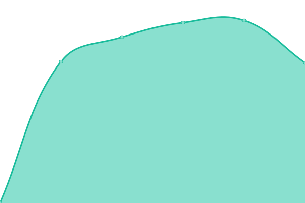 1153ms
     
 | 

<a href="https://pemkotbekasi.github.io/website-status/history/kel-jakasetia">100.00%</a>
    

|  [kel-jatiasih](https://kel-jatiasih.bekasikota.go.id) | 🟩 Up | [kel-jatiasih.yml](https://github.com/pemkotbekasi/website-status/commits/HEAD/history/kel-jatiasih.yml) | 

 1130ms
     
 | 

<a href="https://pemkotbekasi.github.io/website-status/history/kel-jatiasih">100.00%</a>
    

|  [kel-jatibening](https://kel-jatibening.bekasikota.go.id) | 🟩 Up | [kel-jatibening.yml](https://github.com/pemkotbekasi/website-status/commits/HEAD/history/kel-jatibening.yml) | 

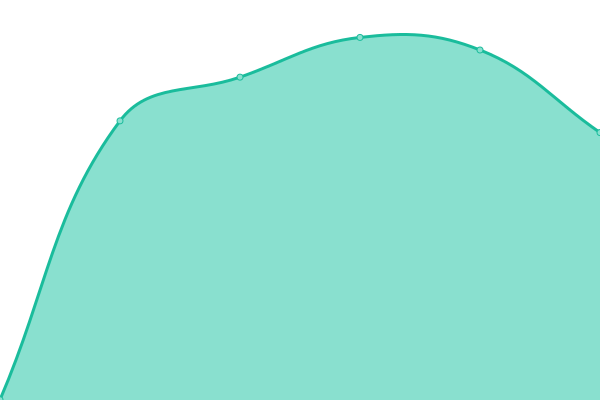 1126ms
     
 | 

<a href="https://pemkotbekasi.github.io/website-status/history/kel-jatibening">100.00%</a>
    

|  [kel-jatibeningbaru](https://kel-jatibeningbaru.bekasikota.go.id) | 🟩 Up | [kel-jatibeningbaru.yml](https://github.com/pemkotbekasi/website-status/commits/HEAD/history/kel-jatibeningbaru.yml) | 

 1129ms
     
 | 

<a href="https://pemkotbekasi.github.io/website-status/history/kel-jatibeningbaru">100.00%</a>
    

|  [kel-jaticempaka](https://kel-jaticempaka.bekasikota.go.id) | 🟩 Up | [kel-jaticempaka.yml](https://github.com/pemkotbekasi/website-status/commits/HEAD/history/kel-jaticempaka.yml) | 

 1127ms
     
 | 

<a href="https://pemkotbekasi.github.io/website-status/history/kel-jaticempaka">100.00%</a>
    

|  [kel-jatikarya](https://kel-jatikarya.bekasikota.go.id) | 🟩 Up | [kel-jatikarya.yml](https://github.com/pemkotbekasi/website-status/commits/HEAD/history/kel-jatikarya.yml) | 

 1243ms
     
 | 

<a href="https://pemkotbekasi.github.io/website-status/history/kel-jatikarya">100.00%</a>
    

|  [kel-jatikramat](https://kel-jatikramat.bekasikota.go.id) | 🟩 Up | [kel-jatikramat.yml](https://github.com/pemkotbekasi/website-status/commits/HEAD/history/kel-jatikramat.yml) | 

 1124ms
     
 | 

<a href="https://pemkotbekasi.github.io/website-status/history/kel-jatikramat">100.00%</a>
    

|  [kel-jatiluhur](https://kel-jatiluhur.bekasikota.go.id) | 🟩 Up | [kel-jatiluhur.yml](https://github.com/pemkotbekasi/website-status/commits/HEAD/history/kel-jatiluhur.yml) | 

 1185ms
     
 | 

<a href="https://pemkotbekasi.github.io/website-status/history/kel-jatiluhur">100.00%</a>
    

|  [kel-jatimakmur](https://kel-jatimakmur.bekasikota.go.id) | 🟩 Up | [kel-jatimakmur.yml](https://github.com/pemkotbekasi/website-status/commits/HEAD/history/kel-jatimakmur.yml) | 

 1255ms
     
 | 

<a href="https://pemkotbekasi.github.io/website-status/history/kel-jatimakmur">100.00%</a>
    

|  [kel-jatimekar](https://kel-jatimekar.bekasikota.go.id) | 🟩 Up | [kel-jatimekar.yml](https://github.com/pemkotbekasi/website-status/commits/HEAD/history/kel-jatimekar.yml) | 

 1127ms
     
 | 

<a href="https://pemkotbekasi.github.io/website-status/history/kel-jatimekar">100.00%</a>
    

|  [kel-jatimelati](https://kel-jatimelati.bekasikota.go.id) | 🟩 Up | [kel-jatimelati.yml](https://github.com/pemkotbekasi/website-status/commits/HEAD/history/kel-jatimelati.yml) | 

 1150ms
     
 | 

<a href="https://pemkotbekasi.github.io/website-status/history/kel-jatimelati">100.00%</a>
    

|  [kel-jatimurni](https://kel-jatimurni.bekasikota.go.id) | 🟩 Up | [kel-jatimurni.yml](https://github.com/pemkotbekasi/website-status/commits/HEAD/history/kel-jatimurni.yml) | 

 1123ms
     
 | 

<a href="https://pemkotbekasi.github.io/website-status/history/kel-jatimurni">100.00%</a>
    

|  [kel-jatiraden](https://kel-jatiraden.bekasikota.go.id) | 🟩 Up | [kel-jatiraden.yml](https://github.com/pemkotbekasi/website-status/commits/HEAD/history/kel-jatiraden.yml) | 

 1139ms
     
 | 

<a href="https://pemkotbekasi.github.io/website-status/history/kel-jatiraden">100.00%</a>
    

|  [kel-jatirahayu](https://kel-jatirahayu.bekasikota.go.id) | 🟩 Up | [kel-jatirahayu.yml](https://github.com/pemkotbekasi/website-status/commits/HEAD/history/kel-jatirahayu.yml) | 

 1154ms
     
 | 

<a href="https://pemkotbekasi.github.io/website-status/history/kel-jatirahayu">99.75%</a>
    

|  [kel-jatirangga](https://kel-jatirangga.bekasikota.go.id) | 🟩 Up | [kel-jatirangga.yml](https://github.com/pemkotbekasi/website-status/commits/HEAD/history/kel-jatirangga.yml) | 

 1150ms
     
 | 

<a href="https://pemkotbekasi.github.io/website-status/history/kel-jatirangga">99.75%</a>
    

|  [kel-jatiranggon](https://kel-jatiranggon.bekasikota.go.id) | 🟩 Up | [kel-jatiranggon.yml](https://github.com/pemkotbekasi/website-status/commits/HEAD/history/kel-jatiranggon.yml) | 

 1135ms
     
 | 

<a href="https://pemkotbekasi.github.io/website-status/history/kel-jatiranggon">99.76%</a>
    

|  [kel-jatirasa](https://kel-jatirasa.bekasikota.go.id) | 🟩 Up | [kel-jatirasa.yml](https://github.com/pemkotbekasi/website-status/commits/HEAD/history/kel-jatirasa.yml) | 

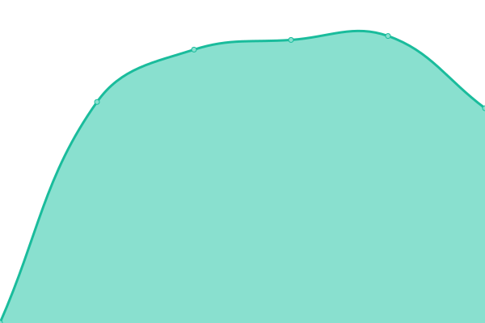 1366ms
     
 | 

<a href="https://pemkotbekasi.github.io/website-status/history/kel-jatirasa">99.76%</a>
    

|  [kel-jatisampurna](https://kel-jatisampurna.bekasikota.go.id) | 🟩 Up | [kel-jatisampurna.yml](https://github.com/pemkotbekasi/website-status/commits/HEAD/history/kel-jatisampurna.yml) | 

 1154ms
     
 | 

<a href="https://pemkotbekasi.github.io/website-status/history/kel-jatisampurna">99.77%</a>
    

|  [kel-jatisari](https://kel-jatisari.bekasikota.go.id) | 🟩 Up | [kel-jatisari.yml](https://github.com/pemkotbekasi/website-status/commits/HEAD/history/kel-jatisari.yml) | 

 1151ms
     
 | 

<a href="https://pemkotbekasi.github.io/website-status/history/kel-jatisari">100.00%</a>
    

|  [kel-jatiwaringin](https://kel-jatiwaringin.bekasikota.go.id) | 🟩 Up | [kel-jatiwaringin.yml](https://github.com/pemkotbekasi/website-status/commits/HEAD/history/kel-jatiwaringin.yml) | 

 1136ms
     
 | 

<a href="https://pemkotbekasi.github.io/website-status/history/kel-jatiwaringin">100.00%</a>
    

|  [kel-jatiwarna](https://kel-jatiwarna.bekasikota.go.id) | 🟩 Up | [kel-jatiwarna.yml](https://github.com/pemkotbekasi/website-status/commits/HEAD/history/kel-jatiwarna.yml) | 

 1126ms
     
 | 

<a href="https://pemkotbekasi.github.io/website-status/history/kel-jatiwarna">100.00%</a>
    

|  [kel-kaliabangtengah](https://kel-kaliabangtengah.bekasikota.go.id) | 🟩 Up | [kel-kaliabangtengah.yml](https://github.com/pemkotbekasi/website-status/commits/HEAD/history/kel-kaliabangtengah.yml) | 

 1133ms
     
 | 

<a href="https://pemkotbekasi.github.io/website-status/history/kel-kaliabangtengah">100.00%</a>
    

|  [kel-kalibaru](https://kel-kalibaru.bekasikota.go.id) | 🟩 Up | [kel-kalibaru.yml](https://github.com/pemkotbekasi/website-status/commits/HEAD/history/kel-kalibaru.yml) | 

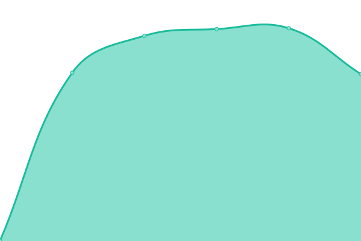 1248ms
     
 | 

<a href="https://pemkotbekasi.github.io/website-status/history/kel-kalibaru">100.00%</a>
    

|  [kel-kayuringinjaya](https://kel-kayuringinjaya.bekasikota.go.id) | 🟩 Up | [kel-kayuringinjaya.yml](https://github.com/pemkotbekasi/website-status/commits/HEAD/history/kel-kayuringinjaya.yml) | 

 1286ms
     
 | 

<a href="https://pemkotbekasi.github.io/website-status/history/kel-kayuringinjaya">100.00%</a>
    

|  [kel-kotabaru](https://kel-kotabaru.bekasikota.go.id) | 🟩 Up | [kel-kotabaru.yml](https://github.com/pemkotbekasi/website-status/commits/HEAD/history/kel-kotabaru.yml) | 

 1132ms
     
 | 

<a href="https://pemkotbekasi.github.io/website-status/history/kel-kotabaru">100.00%</a>
    

|  [kel-kranji](https://kel-kranji.bekasikota.go.id) | 🟩 Up | [kel-kranji.yml](https://github.com/pemkotbekasi/website-status/commits/HEAD/history/kel-kranji.yml) | 

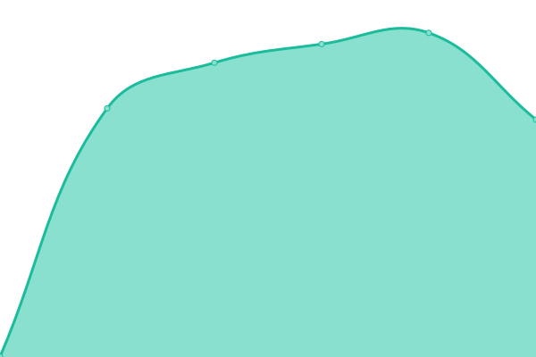 1142ms
     
 | 

<a href="https://pemkotbekasi.github.io/website-status/history/kel-kranji">100.00%</a>
    

|  [kel-margahayu](https://kel-margahayu.bekasikota.go.id) | 🟩 Up | [kel-margahayu.yml](https://github.com/pemkotbekasi/website-status/commits/HEAD/history/kel-margahayu.yml) | 

 1128ms
     
 | 

<a href="https://pemkotbekasi.github.io/website-status/history/kel-margahayu">100.00%</a>
    

|  [kel-margajaya](https://kel-margajaya.bekasikota.go.id) | 🟩 Up | [kel-margajaya.yml](https://github.com/pemkotbekasi/website-status/commits/HEAD/history/kel-margajaya.yml) | 

 1145ms
     
 | 

<a href="https://pemkotbekasi.github.io/website-status/history/kel-margajaya">0.00%</a>
    

|  [kel-margamulya](https://kel-margamulya.bekasikota.go.id) | 🟩 Up | [kel-margamulya.yml](https://github.com/pemkotbekasi/website-status/commits/HEAD/history/kel-margamulya.yml) | 

 1182ms
     
 | 

<a href="https://pemkotbekasi.github.io/website-status/history/kel-margamulya">39.34%</a>
    

|  [kel-medansatria](https://kel-medansatria.bekasikota.go.id) | 🟩 Up | [kel-medansatria.yml](https://github.com/pemkotbekasi/website-status/commits/HEAD/history/kel-medansatria.yml) | 

 1128ms
     
 | 

<a href="https://pemkotbekasi.github.io/website-status/history/kel-medansatria">100.00%</a>
    

|  [kel-mustikajaya](https://kel-mustikajaya.bekasikota.go.id) | 🟩 Up | [kel-mustikajaya.yml](https://github.com/pemkotbekasi/website-status/commits/HEAD/history/kel-mustikajaya.yml) | 

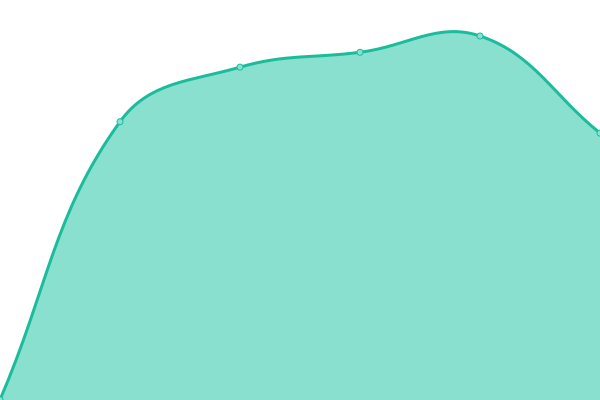 1134ms
     
 | 

<a href="https://pemkotbekasi.github.io/website-status/history/kel-mustikajaya">100.00%</a>
    

|  [kel-mustikasari](https://kel-mustikasari.bekasikota.go.id) | 🟩 Up | [kel-mustikasari.yml](https://github.com/pemkotbekasi/website-status/commits/HEAD/history/kel-mustikasari.yml) | 

 1129ms
     
 | 

<a href="https://pemkotbekasi.github.io/website-status/history/kel-mustikasari">100.00%</a>
    

|  [kel-padurenan](https://kel-padurenan.bekasikota.go.id) | 🟩 Up | [kel-padurenan.yml](https://github.com/pemkotbekasi/website-status/commits/HEAD/history/kel-padurenan.yml) | 

 1133ms
     
 | 

<a href="https://pemkotbekasi.github.io/website-status/history/kel-padurenan">100.00%</a>
    

|  [kel-pejuang](https://kel-pejuang.bekasikota.go.id) | 🟩 Up | [kel-pejuang.yml](https://github.com/pemkotbekasi/website-status/commits/HEAD/history/kel-pejuang.yml) | 

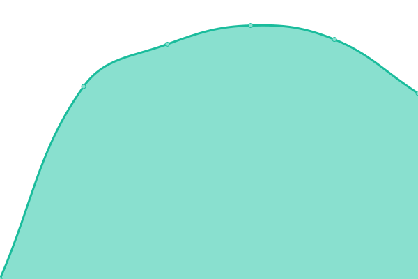 1141ms
     
 | 

<a href="https://pemkotbekasi.github.io/website-status/history/kel-pejuang">100.00%</a>
    

|  [kel-pekayonjaya](https://kel-pekayonjaya.bekasikota.go.id) | 🟩 Up | [kel-pekayonjaya.yml](https://github.com/pemkotbekasi/website-status/commits/HEAD/history/kel-pekayonjaya.yml) | 

 1118ms
     
 | 

<a href="https://pemkotbekasi.github.io/website-status/history/kel-pekayonjaya">100.00%</a>
    

|  [kel-pengasinan](https://kel-pengasinan.bekasikota.go.id) | 🟩 Up | [kel-pengasinan.yml](https://github.com/pemkotbekasi/website-status/commits/HEAD/history/kel-pengasinan.yml) | 

 1140ms
     
 | 

<a href="https://pemkotbekasi.github.io/website-status/history/kel-pengasinan">99.75%</a>
    

|  [kel-perwira](https://kel-perwira.bekasikota.go.id) | 🟩 Up | [kel-perwira.yml](https://github.com/pemkotbekasi/website-status/commits/HEAD/history/kel-perwira.yml) | 

 1127ms
     
 | 

<a href="https://pemkotbekasi.github.io/website-status/history/kel-perwira">99.76%</a>
    

|  [kel-sepanjangjaya](https://kel-sepanjangjaya.bekasikota.go.id) | 🟩 Up | [kel-sepanjangjaya.yml](https://github.com/pemkotbekasi/website-status/commits/HEAD/history/kel-sepanjangjaya.yml) | 

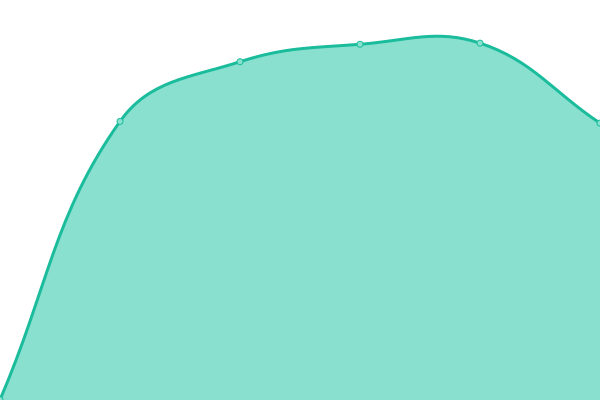 1144ms
     
 | 

<a href="https://pemkotbekasi.github.io/website-status/history/kel-sepanjangjaya">99.76%</a>
    

|  [kel-sumurbatu](https://kel-sumurbatu.bekasikota.go.id) | 🟩 Up | [kel-sumurbatu.yml](https://github.com/pemkotbekasi/website-status/commits/HEAD/history/kel-sumurbatu.yml) | 

 1121ms
     
 | 

<a href="https://pemkotbekasi.github.io/website-status/history/kel-sumurbatu">99.77%</a>
    

|  [kel-telukpucung](https://kel-telukpucung.bekasikota.go.id) | 🟩 Up | [kel-telukpucung.yml](https://github.com/pemkotbekasi/website-status/commits/HEAD/history/kel-telukpucung.yml) | 

 1142ms
     
 | 

<a href="https://pemkotbekasi.github.io/website-status/history/kel-telukpucung">99.77%</a>
    

|  [kelurahan](https://kelurahan.bekasikota.go.id) | 🟩 Up | [kelurahan.yml](https://github.com/pemkotbekasi/website-status/commits/HEAD/history/kelurahan.yml) | 

 1139ms
     
 | 

<a href="https://pemkotbekasi.github.io/website-status/history/kelurahan">100.00%</a>
    

|  [kerjasama](https://kerjasama.bekasikota.go.id) | 🟩 Up | [kerjasama.yml](https://github.com/pemkotbekasi/website-status/commits/HEAD/history/kerjasama.yml) | 

 1308ms
     
 | 

<a href="https://pemkotbekasi.github.io/website-status/history/kerjasama">31.89%</a>
    

|  [kesbangpol](https://kesbangpol.bekasikota.go.id) | 🟩 Up | [kesbangpol.yml](https://github.com/pemkotbekasi/website-status/commits/HEAD/history/kesbangpol.yml) | 

 1403ms
     
 | 

<a href="https://pemkotbekasi.github.io/website-status/history/kesbangpol">3.95%</a>
    

|  [klinikhukum](https://klinikhukum.bekasikota.go.id) | 🟩 Up | [klinikhukum.yml](https://github.com/pemkotbekasi/website-status/commits/HEAD/history/klinikhukum.yml) | 

 1886ms
     
 | 

<a href="https://pemkotbekasi.github.io/website-status/history/klinikhukum">59.97%</a>
    

|  [korpri](https://korpri.bekasikota.go.id) | 🟥 Down | [korpri.yml](https://github.com/pemkotbekasi/website-status/commits/HEAD/history/korpri.yml) | 

 0ms
     
 | 

<a href="https://pemkotbekasi.github.io/website-status/history/korpri">100.00%</a>
    

|  [lantik](https://lantik.bekasikota.go.id) | 🟩 Up | [lantik.yml](https://github.com/pemkotbekasi/website-status/commits/HEAD/history/lantik.yml) | 

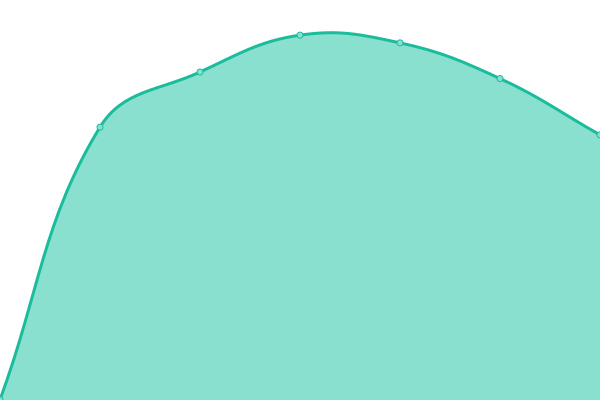 1116ms
     
 | 

<a href="https://pemkotbekasi.github.io/website-status/history/lantik">100.00%</a>
    

|  [lpse](https://lpse.bekasikota.go.id) | 🟥 Down | [lpse.yml](https://github.com/pemkotbekasi/website-status/commits/HEAD/history/lpse.yml) | 

 0ms
     
 | 

<a href="https://pemkotbekasi.github.io/website-status/history/lpse">100.00%</a>
    

|  [mail](https://mail.bekasikota.go.id) | 🟩 Up | [mail.yml](https://github.com/pemkotbekasi/website-status/commits/HEAD/history/mail.yml) | 

 1188ms
     
 | 

<a href="https://pemkotbekasi.github.io/website-status/history/mail">100.00%</a>
    

|  [manfaat-korpri](https://manfaat-korpri.bekasikota.go.id) | 🟥 Down | [manfaat-korpri.yml](https://github.com/pemkotbekasi/website-status/commits/HEAD/history/manfaat-korpri.yml) | 

 0ms
     
 | 

<a href="https://pemkotbekasi.github.io/website-status/history/manfaat-korpri">100.00%</a>
    

|  [monika](https://monika.bekasikota.go.id) | 🟩 Up | [monika.yml](https://github.com/pemkotbekasi/website-status/commits/HEAD/history/monika.yml) | 

 1600ms
     
 | 

<a href="https://pemkotbekasi.github.io/website-status/history/monika">100.00%</a>
    

|  [motekar](https://motekar.bekasikota.go.id) | 🟩 Up | [motekar.yml](https://github.com/pemkotbekasi/website-status/commits/HEAD/history/motekar.yml) | 

 1361ms
     
 | 

<a href="https://pemkotbekasi.github.io/website-status/history/motekar">0.00%</a>
    

|  [mpokesi](https://mpokesi.bekasikota.go.id) | 🟩 Up | [mpokesi.yml](https://github.com/pemkotbekasi/website-status/commits/HEAD/history/mpokesi.yml) | 

 1478ms
     
 | 

<a href="https://pemkotbekasi.github.io/website-status/history/mpokesi">6.52%</a>
    

|  [mpp](https://mpp.bekasikota.go.id) | 🟥 Down | [mpp.yml](https://github.com/pemkotbekasi/website-status/commits/HEAD/history/mpp.yml) | 

 0ms
     
 | 

<a href="https://pemkotbekasi.github.io/website-status/history/mpp">100.00%</a>
    

|  [opdsisukma](https://opdsisukma.bekasikota.go.id) | 🟩 Up | [opdsisukma.yml](https://github.com/pemkotbekasi/website-status/commits/HEAD/history/opdsisukma.yml) | 

 1137ms
     
 | 

<a href="https://pemkotbekasi.github.io/website-status/history/opdsisukma">0.00%</a>
    

|  [optimize](https://optimize.bekasikota.go.id) | 🟥 Down | [optimize.yml](https://github.com/pemkotbekasi/website-status/commits/HEAD/history/optimize.yml) | 

 0ms
     
 | 

<a href="https://pemkotbekasi.github.io/website-status/history/optimize">100.00%</a>
    

|  [panglima](https://panglima.bekasikota.go.id) | 🟩 Up | [panglima.yml](https://github.com/pemkotbekasi/website-status/commits/HEAD/history/panglima.yml) | 

 1949ms
     
 | 

<a href="https://pemkotbekasi.github.io/website-status/history/panglima">99.81%</a>
    

|  [pbj](https://pbj.bekasikota.go.id) | 🟩 Up | [pbj.yml](https://github.com/pemkotbekasi/website-status/commits/HEAD/history/pbj.yml) | 

 1434ms
     
 | 

<a href="https://pemkotbekasi.github.io/website-status/history/pbj">6.52%</a>
    

|  [pdss](https://pdss.bekasikota.go.id) | 🟥 Down | [pdss.yml](https://github.com/pemkotbekasi/website-status/commits/HEAD/history/pdss.yml) | 

 0ms
     
 | 

<a href="https://pemkotbekasi.github.io/website-status/history/pdss">100.00%</a>
    

|  [pendaftaranpkl](https://pendaftaranpkl.bekasikota.go.id) | 🟩 Up | [pendaftaranpkl.yml](https://github.com/pemkotbekasi/website-status/commits/HEAD/history/pendaftaranpkl.yml) | 

 1836ms
     
 | 

<a href="https://pemkotbekasi.github.io/website-status/history/pendaftaranpkl">0.00%</a>
    

|  [pkpt](https://pkpt.bekasikota.go.id) | 🟩 Up | [pkpt.yml](https://github.com/pemkotbekasi/website-status/commits/HEAD/history/pkpt.yml) | 

 1151ms
     
 | 

<a href="https://pemkotbekasi.github.io/website-status/history/pkpt">31.90%</a>
    

|  [portalwebsite](https://portalwebsite.bekasikota.go.id) | 🟩 Up | [portalwebsite.yml](https://github.com/pemkotbekasi/website-status/commits/HEAD/history/portalwebsite.yml) | 

 1176ms
     
 | 

<a href="https://pemkotbekasi.github.io/website-status/history/portalwebsite">100.00%</a>
    

|  [pospbb](https://pospbb.bekasikota.go.id) | 🟥 Down | [pospbb.yml](https://github.com/pemkotbekasi/website-status/commits/HEAD/history/pospbb.yml) | 

 0ms
     
 | 

<a href="https://pemkotbekasi.github.io/website-status/history/pospbb">100.00%</a>
    

|  [ppid](https://ppid.bekasikota.go.id) | 🟥 Down | [ppid.yml](https://github.com/pemkotbekasi/website-status/commits/HEAD/history/ppid.yml) | 

 0ms
     
 | 

<a href="https://pemkotbekasi.github.io/website-status/history/ppid">100.00%</a>
    

|  [ppkm](https://ppkm.bekasikota.go.id) | 🟥 Down | [ppkm.yml](https://github.com/pemkotbekasi/website-status/commits/HEAD/history/ppkm.yml) | 

 0ms
     
 | 

<a href="https://pemkotbekasi.github.io/website-status/history/ppkm">100.00%</a>
    

|  [psw](https://psw.bekasikota.go.id) | 🟩 Up | [psw.yml](https://github.com/pemkotbekasi/website-status/commits/HEAD/history/psw.yml) | 

 1130ms
     
 | 

<a href="https://pemkotbekasi.github.io/website-status/history/psw">100.00%</a>
    

|  [puskesmas-kaliabangtengah](https://puskesmas-kaliabangtengah.bekasikota.go.id) | 🟩 Up | [puskesmas-kaliabangtengah.yml](https://github.com/pemkotbekasi/website-status/commits/HEAD/history/puskesmas-kaliabangtengah.yml) | 

 1732ms
     
 | 

<a href="https://pemkotbekasi.github.io/website-status/history/puskesmas-kaliabangtengah">99.46%</a>
    

|  [rapor](https://rapor.bekasikota.go.id) | 🟩 Up | [rapor.yml](https://github.com/pemkotbekasi/website-status/commits/HEAD/history/rapor.yml) | 

 1449ms
     
 | 

<a href="https://pemkotbekasi.github.io/website-status/history/rapor">100.00%</a>
    

|  [rsud](https://rsud.bekasikota.go.id) | 🟩 Up | [rsud.yml](https://github.com/pemkotbekasi/website-status/commits/HEAD/history/rsud.yml) | 

 2713ms
     
 | 

<a href="https://pemkotbekasi.github.io/website-status/history/rsud">0.71%</a>
    

|  [sakerhumas](https://sakerhumas.bekasikota.go.id) | 🟥 Down | [sakerhumas.yml](https://github.com/pemkotbekasi/website-status/commits/HEAD/history/sakerhumas.yml) | 

 0ms
     
 | 

<a href="https://pemkotbekasi.github.io/website-status/history/sakerhumas">100.00%</a>
    

|  [sakip](https://sakip.bekasikota.go.id) | 🟩 Up | [sakip.yml](https://github.com/pemkotbekasi/website-status/commits/HEAD/history/sakip.yml) | 

 1084ms
     
 | 

<a href="https://pemkotbekasi.github.io/website-status/history/sakip">6.52%</a>
    

|  [sate](https://sate.bekasikota.go.id) | 🟩 Up | [sate.yml](https://github.com/pemkotbekasi/website-status/commits/HEAD/history/sate.yml) | 

 1106ms
     
 | 

<a href="https://pemkotbekasi.github.io/website-status/history/sate">6.52%</a>
    

|  [satpolpp](https://satpolpp.bekasikota.go.id) | 🟩 Up | [satpolpp.yml](https://github.com/pemkotbekasi/website-status/commits/HEAD/history/satpolpp.yml) | 

 1690ms
     
 | 

<a href="https://pemkotbekasi.github.io/website-status/history/satpolpp">45.82%</a>
    

|  [satudata](https://satudata.bekasikota.go.id) | 🟥 Down | [satudata.yml](https://github.com/pemkotbekasi/website-status/commits/HEAD/history/satudata.yml) | 

 0ms
     
 | 

<a href="https://pemkotbekasi.github.io/website-status/history/satudata">100.00%</a>
    

|  [sbm](https://sbm.bekasikota.go.id) | 🟩 Up | [sbm.yml](https://github.com/pemkotbekasi/website-status/commits/HEAD/history/sbm.yml) | 

 1111ms
     
 | 

<a href="https://pemkotbekasi.github.io/website-status/history/sbm">31.91%</a>
    

|  [sentimen](https://sentimen.bekasikota.go.id) | 🟥 Down | [sentimen.yml](https://github.com/pemkotbekasi/website-status/commits/HEAD/history/sentimen.yml) | 

 0ms
     
 | 

<a href="https://pemkotbekasi.github.io/website-status/history/sentimen">100.00%</a>
    

|  [setda](https://setda.bekasikota.go.id) | 🟩 Up | [setda.yml](https://github.com/pemkotbekasi/website-status/commits/HEAD/history/setda.yml) | 

 1525ms
     
 | 

<a href="https://pemkotbekasi.github.io/website-status/history/setda">92.87%</a>
    

|  [sht](https://sht.bekasikota.go.id) | 🟩 Up | [sht.yml](https://github.com/pemkotbekasi/website-status/commits/HEAD/history/sht.yml) | 

 1551ms
     
 | 

<a href="https://pemkotbekasi.github.io/website-status/history/sht">6.52%</a>
    

|  [siakip](https://siakip.bekasikota.go.id) | 🟩 Up | [siakip.yml](https://github.com/pemkotbekasi/website-status/commits/HEAD/history/siakip.yml) | 

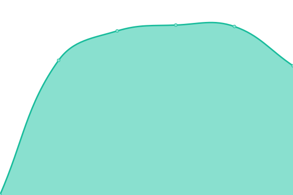 2007ms
     
 | 

<a href="https://pemkotbekasi.github.io/website-status/history/siakip">39.22%</a>
    

|  [siap](https://siap.bekasikota.go.id) | 🟩 Up | [siap.yml](https://github.com/pemkotbekasi/website-status/commits/HEAD/history/siap.yml) | 

 1127ms
     
 | 

<a href="https://pemkotbekasi.github.io/website-status/history/siap">39.22%</a>
    

|  [siapd-dprd](https://siapd-dprd.bekasikota.go.id) | 🟥 Down | [siapd-dprd.yml](https://github.com/pemkotbekasi/website-status/commits/HEAD/history/siapd-dprd.yml) | 

 1124ms
     
 | 

<a href="https://pemkotbekasi.github.io/website-status/history/siapd-dprd">0.00%</a>
    

|  [sibandek](https://sibandek.bekasikota.go.id) | 🟩 Up | [sibandek.yml](https://github.com/pemkotbekasi/website-status/commits/HEAD/history/sibandek.yml) | 

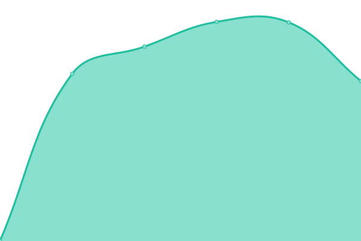 1135ms
     
 | 

<a href="https://pemkotbekasi.github.io/website-status/history/sibandek">39.23%</a>
    

|  [sicandra](https://sicandra.bekasikota.go.id) | 🟥 Down | [sicandra.yml](https://github.com/pemkotbekasi/website-status/commits/HEAD/history/sicandra.yml) | 

 0ms
     
 | 

<a href="https://pemkotbekasi.github.io/website-status/history/sicandra">0.00%</a>
    

|  [sidalrek](https://sidalrek.bekasikota.go.id) | 🟥 Down | [sidalrek.yml](https://github.com/pemkotbekasi/website-status/commits/HEAD/history/sidalrek.yml) | 

 0ms
     
 | 

<a href="https://pemkotbekasi.github.io/website-status/history/sidalrek">0.00%</a>
    

|  [sidikjari](https://sidikjari.bekasikota.go.id) | 🟥 Down | [sidikjari.yml](https://github.com/pemkotbekasi/website-status/commits/HEAD/history/sidikjari.yml) | 

 0ms
     
 | 

<a href="https://pemkotbekasi.github.io/website-status/history/sidikjari">0.00%</a>
    

|  [siencang](https://siencang.bekasikota.go.id) | 🟩 Up | [siencang.yml](https://github.com/pemkotbekasi/website-status/commits/HEAD/history/siencang.yml) | 

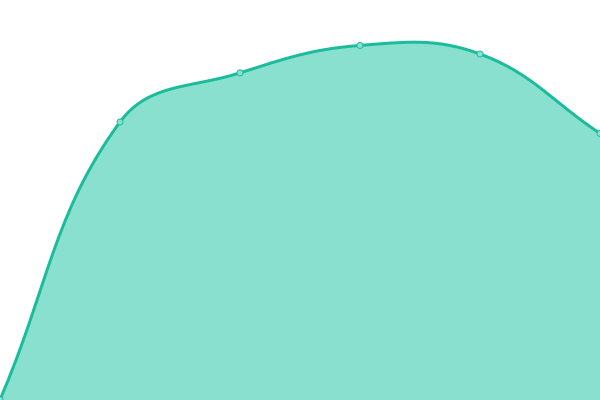 1126ms
     
 | 

<a href="https://pemkotbekasi.github.io/website-status/history/siencang">39.02%</a>
    

|  [siharsa](https://siharsa.bekasikota.go.id) | 🟥 Down | [siharsa.yml](https://github.com/pemkotbekasi/website-status/commits/HEAD/history/siharsa.yml) | 

 0ms
     
 | 

<a href="https://pemkotbekasi.github.io/website-status/history/siharsa">0.00%</a>
    

|  [siibeken](https://siibeken.bekasikota.go.id) | 🟩 Up | [siibeken.yml](https://github.com/pemkotbekasi/website-status/commits/HEAD/history/siibeken.yml) | 

 2008ms
     
 | 

<a href="https://pemkotbekasi.github.io/website-status/history/siibeken">100.00%</a>
    

|  [sijampang](https://sijampang.bekasikota.go.id) | 🟩 Up | [sijampang.yml](https://github.com/pemkotbekasi/website-status/commits/HEAD/history/sijampang.yml) | 

 1645ms
     
 | 

<a href="https://pemkotbekasi.github.io/website-status/history/sijampang">67.78%</a>
    

|  [sijiwa](https://sijiwa.bekasikota.go.id) | 🟩 Up | [sijiwa.yml](https://github.com/pemkotbekasi/website-status/commits/HEAD/history/sijiwa.yml) | 

 1149ms
     
 | 

<a href="https://pemkotbekasi.github.io/website-status/history/sijiwa">0.00%</a>
    

|  [sijoni](https://sijoni.bekasikota.go.id) | 🟥 Down | [sijoni.yml](https://github.com/pemkotbekasi/website-status/commits/HEAD/history/sijoni.yml) | 

 0ms
     
 | 

<a href="https://pemkotbekasi.github.io/website-status/history/sijoni">0.00%</a>
    

|  [sikasep](https://sikasep.bekasikota.go.id) | 🟩 Up | [sikasep.yml](https://github.com/pemkotbekasi/website-status/commits/HEAD/history/sikasep.yml) | 

 1608ms
     
 | 

<a href="https://pemkotbekasi.github.io/website-status/history/sikasep">99.60%</a>
    

|  [sikat](https://sikat.bekasikota.go.id) | 🟥 Down | [sikat.yml](https://github.com/pemkotbekasi/website-status/commits/HEAD/history/sikat.yml) | 

 2530ms
     
 | 

<a href="https://pemkotbekasi.github.io/website-status/history/sikat">99.31%</a>
    

|  [sikepo](https://sikepo.bekasikota.go.id) | 🟩 Up | [sikepo.yml](https://github.com/pemkotbekasi/website-status/commits/HEAD/history/sikepo.yml) | 

 3902ms
     
 | 

<a href="https://pemkotbekasi.github.io/website-status/history/sikepo">80.09%</a>
    

|  [sikerja](https://sikerja.bekasikota.go.id) | 🟩 Up | [sikerja.yml](https://github.com/pemkotbekasi/website-status/commits/HEAD/history/sikerja.yml) | 

 5906ms
     
 | 

<a href="https://pemkotbekasi.github.io/website-status/history/sikerja">94.44%</a>
    

|  [silat](https://silat.bekasikota.go.id) | 🟩 Up | [silat.yml](https://github.com/pemkotbekasi/website-status/commits/HEAD/history/silat.yml) | 

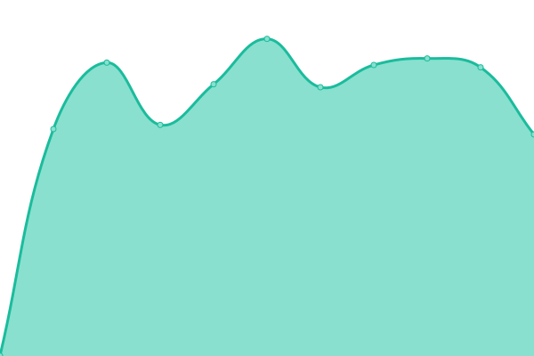 1546ms
     
 | 

<a href="https://pemkotbekasi.github.io/website-status/history/silat">97.81%</a>
    

|  [simapan](https://simapan.bekasikota.go.id) | 🟩 Up | [simapan.yml](https://github.com/pemkotbekasi/website-status/commits/HEAD/history/simapan.yml) | 

 1648ms
     
 | 

<a href="https://pemkotbekasi.github.io/website-status/history/simapan">4.74%</a>
    

|  [simblt](https://simblt.bekasikota.go.id) | 🟥 Down | [simblt.yml](https://github.com/pemkotbekasi/website-status/commits/HEAD/history/simblt.yml) | 

 0ms
     
 | 

<a href="https://pemkotbekasi.github.io/website-status/history/simblt">0.00%</a>
    

|  [simda](https://simda.bekasikota.go.id) | 🟩 Up | [simda.yml](https://github.com/pemkotbekasi/website-status/commits/HEAD/history/simda.yml) | 

 1916ms
     
 | 

<a href="https://pemkotbekasi.github.io/website-status/history/simda">99.01%</a>
    

|  [simda1](https://simda1.bekasikota.go.id) | 🟥 Down | [simda1.yml](https://github.com/pemkotbekasi/website-status/commits/HEAD/history/simda1.yml) | 

 0ms
     
 | 

<a href="https://pemkotbekasi.github.io/website-status/history/simda1">0.00%</a>
    

|  [simda2](https://simda2.bekasikota.go.id) | 🟥 Down | [simda2.yml](https://github.com/pemkotbekasi/website-status/commits/HEAD/history/simda2.yml) | 

 0ms
     
 | 

<a href="https://pemkotbekasi.github.io/website-status/history/simda2">0.00%</a>
    

|  [simdara](https://simdara.bekasikota.go.id) | 🟩 Up | [simdara.yml](https://github.com/pemkotbekasi/website-status/commits/HEAD/history/simdara.yml) | 

 1625ms
     
 | 

<a href="https://pemkotbekasi.github.io/website-status/history/simdara">99.53%</a>
    

|  [simkerja](https://simkerja.bekasikota.go.id) | 🟩 Up | [simkerja.yml](https://github.com/pemkotbekasi/website-status/commits/HEAD/history/simkerja.yml) | 

 1362ms
     
 | 

<a href="https://pemkotbekasi.github.io/website-status/history/simkerja">100.00%</a>
    

|  [simpatda](https://simpatda.bekasikota.go.id) | 🟥 Down | [simpatda.yml](https://github.com/pemkotbekasi/website-status/commits/HEAD/history/simpatda.yml) | 

 0ms
     
 | 

<a href="https://pemkotbekasi.github.io/website-status/history/simpatda">0.00%</a>
    

|  [simpelbang](https://simpelbang.bekasikota.go.id) | 🟩 Up | [simpelbang.yml](https://github.com/pemkotbekasi/website-status/commits/HEAD/history/simpelbang.yml) | 

 1098ms
     
 | 

<a href="https://pemkotbekasi.github.io/website-status/history/simpelbang">99.80%</a>
    

|  [simpel-disparbud](https://simpel-disparbud.bekasikota.go.id) | 🟩 Up | [simpel-disparbud.yml](https://github.com/pemkotbekasi/website-status/commits/HEAD/history/simpel-disparbud.yml) | 

 1490ms
     
 | 

<a href="https://pemkotbekasi.github.io/website-status/history/simpel-disparbud">99.81%</a>
    

|  [simpelman-dbmsda](https://simpelman-dbmsda.bekasikota.go.id) | 🟥 Down | [simpelman-dbmsda.yml](https://github.com/pemkotbekasi/website-status/commits/HEAD/history/simpelman-dbmsda.yml) | 

 0ms
     
 | 

<a href="https://pemkotbekasi.github.io/website-status/history/simpelman-dbmsda">0.00%</a>
    

|  [simpkl](https://simpkl.bekasikota.go.id) | 🟥 Down | [simpkl.yml](https://github.com/pemkotbekasi/website-status/commits/HEAD/history/simpkl.yml) | 

 0ms
     
 | 

<a href="https://pemkotbekasi.github.io/website-status/history/simpkl">0.00%</a>
    

|  [simpo](https://simpo.bekasikota.go.id) | 🟩 Up | [simpo.yml](https://github.com/pemkotbekasi/website-status/commits/HEAD/history/simpo.yml) | 

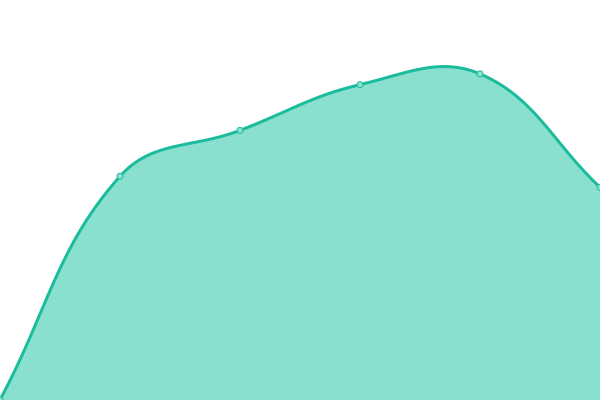 1628ms
     
 | 

<a href="https://pemkotbekasi.github.io/website-status/history/simpo">99.81%</a>
    

|  [simpokasi](https://simpokasi.bekasikota.go.id) | 🟩 Up | [simpokasi.yml](https://github.com/pemkotbekasi/website-status/commits/HEAD/history/simpokasi.yml) | 

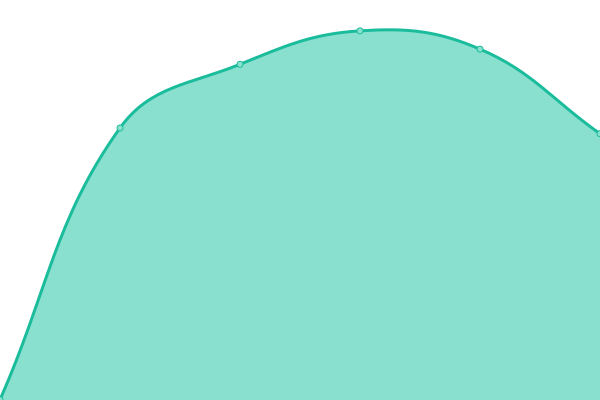 1130ms
     
 | 

<a href="https://pemkotbekasi.github.io/website-status/history/simpokasi">99.82%</a>
    

|  [sip3](https://sip3.bekasikota.go.id) | 🟩 Up | [sip3.yml](https://github.com/pemkotbekasi/website-status/commits/HEAD/history/sip3.yml) | 

 2128ms
     
 | 

<a href="https://pemkotbekasi.github.io/website-status/history/sip3">99.80%</a>
    

|  [sipas](https://sipas.bekasikota.go.id) | 🟥 Down | [sipas.yml](https://github.com/pemkotbekasi/website-status/commits/HEAD/history/sipas.yml) | 

 0ms
     
 | 

<a href="https://pemkotbekasi.github.io/website-status/history/sipas">0.00%</a>
    

|  [sipaten](https://sipaten.bekasikota.go.id) | 🟩 Up | [sipaten.yml](https://github.com/pemkotbekasi/website-status/commits/HEAD/history/sipaten.yml) | 

 1138ms
     
 | 

<a href="https://pemkotbekasi.github.io/website-status/history/sipaten">99.82%</a>
    

|  [sipdah](https://sipdah.bekasikota.go.id) | 🟥 Down | [sipdah.yml](https://github.com/pemkotbekasi/website-status/commits/HEAD/history/sipdah.yml) | 

 0ms
     
 | 

<a href="https://pemkotbekasi.github.io/website-status/history/sipdah">0.00%</a>
    

|  [sipeng](https://sipeng.bekasikota.go.id) | 🟥 Down | [sipeng.yml](https://github.com/pemkotbekasi/website-status/commits/HEAD/history/sipeng.yml) | 

 0ms
     
 | 

<a href="https://pemkotbekasi.github.io/website-status/history/sipeng">0.00%</a>
    

|  [sipenguber](https://sipenguber.bekasikota.go.id) | 🟥 Down | [sipenguber.yml](https://github.com/pemkotbekasi/website-status/commits/HEAD/history/sipenguber.yml) | 

 0ms
     
 | 

<a href="https://pemkotbekasi.github.io/website-status/history/sipenguber">0.00%</a>
    

|  [sipjalu](https://sipjalu.bekasikota.go.id) | 🟩 Up | [sipjalu.yml](https://github.com/pemkotbekasi/website-status/commits/HEAD/history/sipjalu.yml) | 

 1638ms
     
 | 

<a href="https://pemkotbekasi.github.io/website-status/history/sipjalu">77.63%</a>
    

|  [sipkom](https://sipkom.bekasikota.go.id) | 🟩 Up | [sipkom.yml](https://github.com/pemkotbekasi/website-status/commits/HEAD/history/sipkom.yml) | 

 2135ms
     
 | 

<a href="https://pemkotbekasi.github.io/website-status/history/sipkom">100.00%</a>
    

|  [sipo](https://sipo.bekasikota.go.id) | 🟩 Up | [sipo.yml](https://github.com/pemkotbekasi/website-status/commits/HEAD/history/sipo.yml) | 

 1517ms
     
 | 

<a href="https://pemkotbekasi.github.io/website-status/history/sipo">99.80%</a>
    

|  [sippp](https://sippp.bekasikota.go.id) | 🟩 Up | [sippp.yml](https://github.com/pemkotbekasi/website-status/commits/HEAD/history/sippp.yml) | 

 21791ms
     
 | 

<a href="https://pemkotbekasi.github.io/website-status/history/sippp">59.81%</a>
    

|  [sirenda](https://sirenda.bekasikota.go.id) | 🟩 Up | [sirenda.yml](https://github.com/pemkotbekasi/website-status/commits/HEAD/history/sirenda.yml) | 

 1585ms
     
 | 

<a href="https://pemkotbekasi.github.io/website-status/history/sirenda">100.00%</a>
    

|  [sirida](https://sirida.bekasikota.go.id) | 🟥 Down | [sirida.yml](https://github.com/pemkotbekasi/website-status/commits/HEAD/history/sirida.yml) | 

 0ms
     
 | 

<a href="https://pemkotbekasi.github.io/website-status/history/sirida">0.00%</a>
    

|  [sisukma](https://sisukma.bekasikota.go.id) | 🟩 Up | [sisukma.yml](https://github.com/pemkotbekasi/website-status/commits/HEAD/history/sisukma.yml) | 

 1147ms
     
 | 

<a href="https://pemkotbekasi.github.io/website-status/history/sisukma">100.00%</a>
    

|  [sitaru](https://sitaru.bekasikota.go.id) | 🟩 Up | [sitaru.yml](https://github.com/pemkotbekasi/website-status/commits/HEAD/history/sitaru.yml) | 

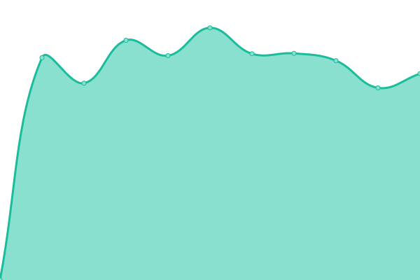 2449ms
     
 | 

<a href="https://pemkotbekasi.github.io/website-status/history/sitaru">98.83%</a>
    

|  [sitekar](https://sitekar.bekasikota.go.id) | 🟩 Up | [sitekar.yml](https://github.com/pemkotbekasi/website-status/commits/HEAD/history/sitekar.yml) | 

 3843ms
     
 | 

<a href="https://pemkotbekasi.github.io/website-status/history/sitekar">75.77%</a>
    

|  [slimpro](https://slimpro.bekasikota.go.id) | 🟩 Up | [slimpro.yml](https://github.com/pemkotbekasi/website-status/commits/HEAD/history/slimpro.yml) | 

 1150ms
     
 | 

<a href="https://pemkotbekasi.github.io/website-status/history/slimpro">40.86%</a>
    

|  [smartcity](https://smartcity.bekasikota.go.id) | 🟥 Down | [smartcity.yml](https://github.com/pemkotbekasi/website-status/commits/HEAD/history/smartcity.yml) | 

 0ms
     
 | 

<a href="https://pemkotbekasi.github.io/website-status/history/smartcity">0.00%</a>
    

|  [smpn10](https://smpn10.bekasikota.go.id) | 🟩 Up | [smpn10.yml](https://github.com/pemkotbekasi/website-status/commits/HEAD/history/smpn10.yml) | 

 1622ms
     
 | 

<a href="https://pemkotbekasi.github.io/website-status/history/smpn10">99.38%</a>
    

|  [sohib](https://sohib.bekasikota.go.id) | 🟩 Up | [sohib.yml](https://github.com/pemkotbekasi/website-status/commits/HEAD/history/sohib.yml) | 

 2206ms
     
 | 

<a href="https://pemkotbekasi.github.io/website-status/history/sohib">99.80%</a>
    

|  [sp2d](https://sp2d.bekasikota.go.id) | 🟥 Down | [sp2d.yml](https://github.com/pemkotbekasi/website-status/commits/HEAD/history/sp2d.yml) | 

 0ms
     
 | 

<a href="https://pemkotbekasi.github.io/website-status/history/sp2d">0.00%</a>
    

|  [splp](https://splp.bekasikota.go.id) | 🟩 Up | [splp.yml](https://github.com/pemkotbekasi/website-status/commits/HEAD/history/splp.yml) | 

 1175ms
     
 | 

<a href="https://pemkotbekasi.github.io/website-status/history/splp">100.00%</a>
    

|  [sso](https://sso.bekasikota.go.id) | 🟩 Up | [sso.yml](https://github.com/pemkotbekasi/website-status/commits/HEAD/history/sso.yml) | 

 1589ms
     
 | 

<a href="https://pemkotbekasi.github.io/website-status/history/sso">100.00%</a>
    

|  [surti](https://surti.bekasikota.go.id) | 🟩 Up | [surti.yml](https://github.com/pemkotbekasi/website-status/commits/HEAD/history/surti.yml) | 

 1143ms
     
 | 

<a href="https://pemkotbekasi.github.io/website-status/history/surti">95.74%</a>
    

|  [tabang](https://tabang.bekasikota.go.id) | 🟥 Down | [tabang.yml](https://github.com/pemkotbekasi/website-status/commits/HEAD/history/tabang.yml) | 

 0ms
     
 | 

<a href="https://pemkotbekasi.github.io/website-status/history/tabang">0.00%</a>
    

|  [tabulasidata](https://tabulasidata.bekasikota.go.id) | 🟩 Up | [tabulasidata.yml](https://github.com/pemkotbekasi/website-status/commits/HEAD/history/tabulasidata.yml) | 

 2039ms
     
 | 

<a href="https://pemkotbekasi.github.io/website-status/history/tabulasidata">100.00%</a>
    

|  [tkk](https://tkk.bekasikota.go.id) | 🟩 Up | [tkk.yml](https://github.com/pemkotbekasi/website-status/commits/HEAD/history/tkk.yml) | 

 1426ms
     
 | 

<a href="https://pemkotbekasi.github.io/website-status/history/tkk">99.59%</a>
    

|  [tnde](https://tnde.bekasikota.go.id) | 🟩 Up | [tnde.yml](https://github.com/pemkotbekasi/website-status/commits/HEAD/history/tnde.yml) | 

 1368ms
     
 | 

<a href="https://pemkotbekasi.github.io/website-status/history/tnde">95.76%</a>
    

|  [tppkk](https://tppkk.bekasikota.go.id) | 🟩 Up | [tppkk.yml](https://github.com/pemkotbekasi/website-status/commits/HEAD/history/tppkk.yml) | 

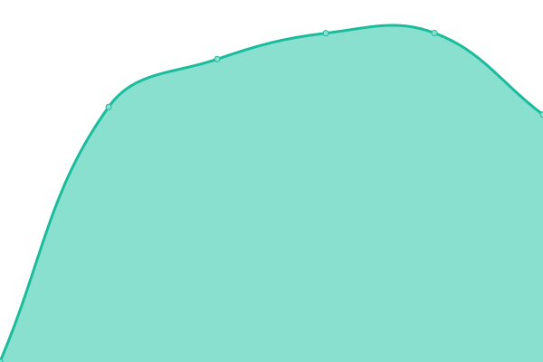 1471ms
     
 | 

<a href="https://pemkotbekasi.github.io/website-status/history/tppkk">100.00%</a>
    

|  [udms](https://udms.bekasikota.go.id) | 🟩 Up | [udms.yml](https://github.com/pemkotbekasi/website-status/commits/HEAD/history/udms.yml) | 

 1595ms
     
 | 

<a href="https://pemkotbekasi.github.io/website-status/history/udms">99.51%</a>
    

|  [wbs](https://wbs.bekasikota.go.id) | 🟥 Down | [wbs.yml](https://github.com/pemkotbekasi/website-status/commits/HEAD/history/wbs.yml) | 

 0ms
     
 | 

<a href="https://pemkotbekasi.github.io/website-status/history/wbs">0.00%</a>
    

|  [wisata](https://wisata.bekasikota.go.id) | 🟩 Up | [wisata.yml](https://github.com/pemkotbekasi/website-status/commits/HEAD/history/wisata.yml) | 

 1458ms
     
 | 

<a href="https://pemkotbekasi.github.io/website-status/history/wisata">94.74%</a>
    

|  [wp](https://wp.bekasikota.go.id) | 🟩 Up | [wp.yml](https://github.com/pemkotbekasi/website-status/commits/HEAD/history/wp.yml) | 

 1554ms
     
 | 

<a href="https://pemkotbekasi.github.io/website-status/history/wp">99.80%</a>
    

<!--end: status pages-->

[**Visit our status website →**](https://pemkotbekasi.github.io/website-status)

## 📄 License

- Powered by: [Upptime](https://github.com/upptime/upptime)
- Code: [MIT](./LICENSE) © [Pemerintah Kota Bekasi](https://www.bekasikota.go.id/)
- Data in the `./history` directory: [Open Database License](https://opendatacommons.org/licenses/odbl/1-0/)
